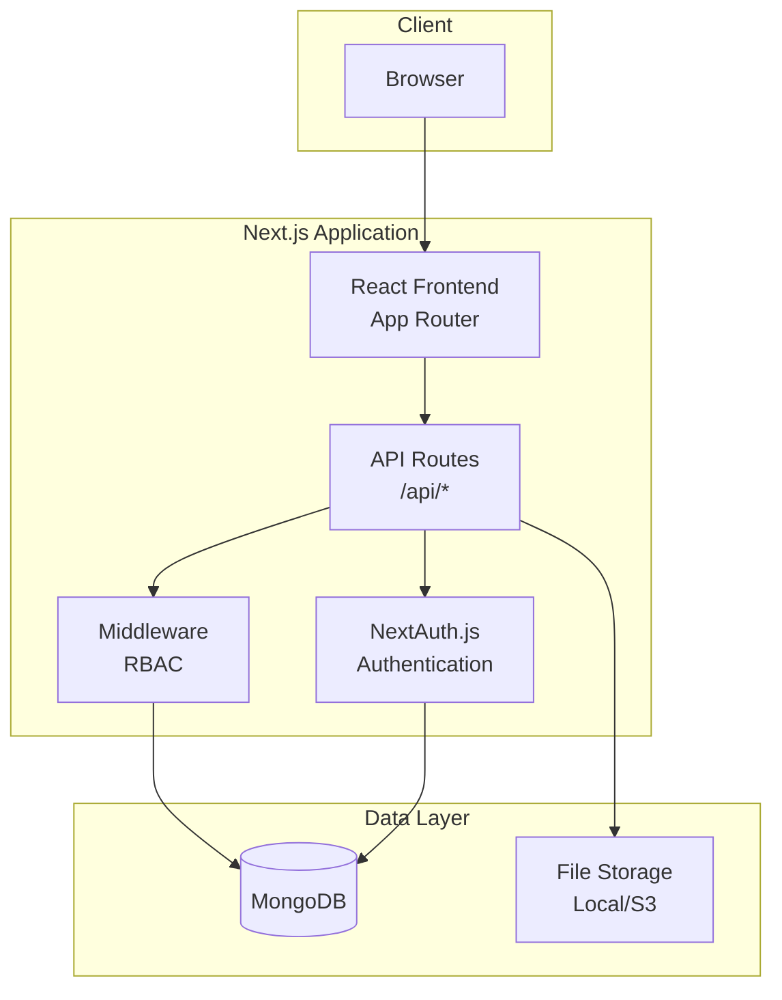
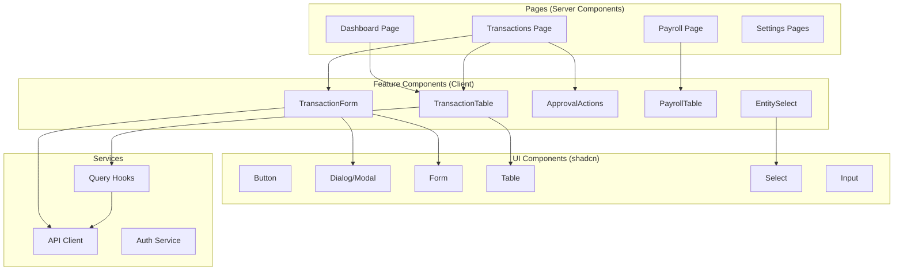
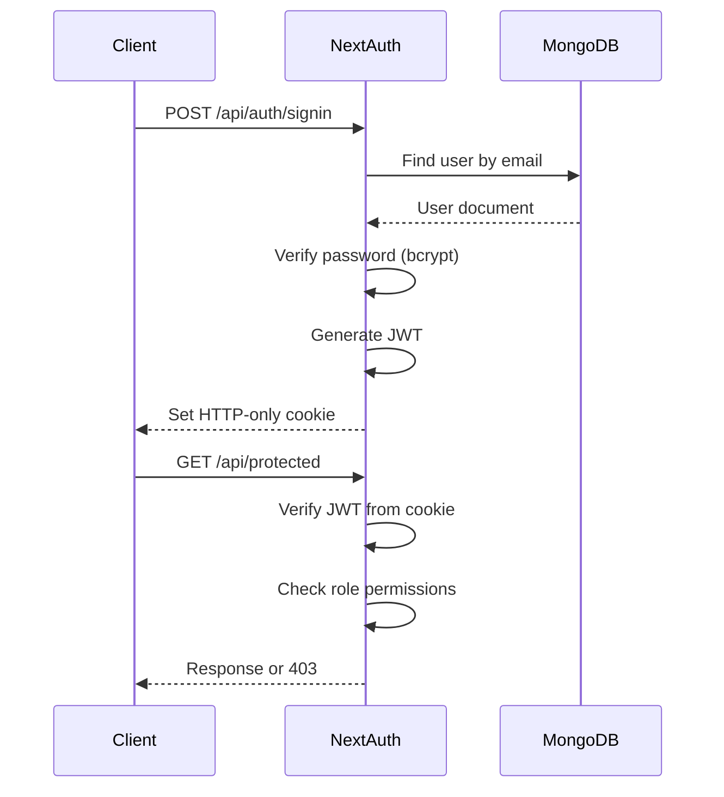

# Diocese Management System (GPBMT.ORG)
# Architecture Document

---

## Introduction

This document defines the technical architecture for the Diocese Management System (GPBMT.ORG), a web-based platform for managing parishes, parishioners, finances, personnel, and assets for Buon Ma Thuot Diocese.

**PRD Reference:** docs/prd.md
**Starter Template:** No

## Change Log

| Date | Version | Description | Author |
|------|---------|-------------|--------|
| 2026-01-29 | 1.0 | Initial architecture | @planner |

---

## High Level Architecture

### Technical Summary

The system is built as a **Next.js fullstack monolith** using the App Router. The frontend uses React with shadcn/ui components and Tailwind CSS for styling. The backend consists of Next.js API routes connecting to MongoDB. Authentication is handled by NextAuth.js with JWT tokens and role-based access control (RBAC).

### Architecture Style

**Monolith (Next.js Fullstack)**

Rationale: MVP scope with clear domain boundaries. Single deployment unit simplifies operations. Can be decomposed later if needed.

### High Level Diagram



### Key Architectural Patterns

| Pattern | Purpose |
|---------|---------|
| **Server Components** | Default for pages, reduces client JS bundle |
| **Client Components** | Interactive UI (forms, tables, modals) |
| **API Routes** | RESTful endpoints in `/app/api/` |
| **Repository Pattern** | Data access abstraction via Mongoose models |
| **Middleware** | Auth and RBAC checks before route handlers |
| **React Query** | Server state management, caching, background refresh |

---

## Tech Stack

> **CRITICAL:** This is the SINGLE SOURCE OF TRUTH for technology choices. All implementation must reference this section.

| Category | Technology | Version | Purpose | Rationale |
|----------|------------|---------|---------|-----------|
| **Language** | TypeScript | 5.3.x | Primary language | Type safety, better DX, catch errors at compile time |
| **Runtime** | Node.js | 20.x LTS | Server runtime | Stability, long-term support, wide ecosystem |
| **Framework** | Next.js | 14.x | Fullstack React | App Router, Server Components, API routes, built-in optimization |
| **Styling** | Tailwind CSS | 3.4.x | Utility-first CSS | Rapid development, consistent design, small bundle |
| **UI Components** | shadcn/ui | latest | Component library | High quality, accessible, customizable, copy-paste |
| **Database** | MongoDB | 7.x | Document database | Flexible schema, good for nested documents, scalable |
| **ODM** | Mongoose | 8.x | MongoDB ODM | Schema validation, middleware, TypeScript support |
| **Forms** | React Hook Form | 7.x | Form management | Performant, minimal re-renders, easy validation |
| **Validation** | Yup | 1.x | Schema validation | Declarative, composable, works with RHF |
| **Tables** | TanStack Table | 8.x | Data tables | Headless, powerful filtering/sorting/pagination |
| **Data Fetching** | TanStack Query | 5.x | Server state | Caching, background updates, optimistic UI |
| **Auth** | NextAuth.js | 5.x (Auth.js) | Authentication | Native Next.js integration, JWT, multiple providers |
| **Icons** | Lucide React | latest | Icon library | Consistent, tree-shakeable, works with shadcn |
| **Date** | date-fns | 3.x | Date manipulation | Lightweight, tree-shakeable, immutable |
| **File Upload** | Local FS (MVP) | - | File storage | Simple for MVP, migrate to S3 later |
| **Testing** | Vitest | 1.x | Unit/Integration | Fast, Vite-native, Jest-compatible API |
| **E2E Testing** | Playwright | 1.x | E2E tests | Cross-browser, reliable, good DX |
| **Linting** | ESLint | 8.x | Code linting | Catch errors, enforce standards |
| **Formatting** | Prettier | 3.x | Code formatting | Consistent style, auto-format |
| **Package Manager** | pnpm | 8.x | Dependencies | Fast, disk-efficient, strict |

---

## Data Models

### User

**Purpose:** System users with authentication and role assignment

```typescript
interface User {
  _id: ObjectId;
  email: string;              // unique, required
  password: string;           // hashed with bcrypt
  name: string;               // required
  phone?: string;
  role: Role;                 // enum
  parishId?: ObjectId;        // required for PARISH_PRIEST, PARISH_SECRETARY
  isActive: boolean;          // default: true
  lastLogin?: Date;
  createdAt: Date;
  updatedAt: Date;
}

enum Role {
  SUPER_ADMIN = 'super_admin',
  MANAGER_PRIEST = 'manager_priest',
  PARISH_PRIEST = 'parish_priest',
  ACCOUNTANT = 'accountant',
  PARISH_SECRETARY = 'parish_secretary'
}
```

**Relationships:**
- User belongs to Parish (optional, via parishId)

---

### Parish

**Purpose:** Diocese parishes/churches

```typescript
interface Parish {
  _id: ObjectId;
  name: string;               // required, unique
  address: string;            // required
  phone?: string;
  email?: string;
  priestName?: string;
  notes?: string;
  isActive: boolean;          // default: true (soft delete)
  createdAt: Date;
  updatedAt: Date;
}
```

**Relationships:**
- Parish has many Parishioners
- Parish has many Users (priests, secretaries)

---

### Parishioner

**Purpose:** Parish members/congregation

```typescript
interface Parishioner {
  _id: ObjectId;
  parishId: ObjectId;         // required, ref: Parish
  name: string;               // required
  phone?: string;
  address?: string;
  dateOfBirth?: Date;
  notes?: string;
  isActive: boolean;          // default: true
  createdAt: Date;
  updatedAt: Date;
}
```

**Relationships:**
- Parishioner belongs to Parish

---

### Fund

**Purpose:** Financial fund categories (11 funds in 3 groups)

```typescript
interface Fund {
  _id: ObjectId;
  name: string;               // required, unique
  group: FundGroup;           // A, B, or C
  description?: string;
  isActive: boolean;          // default: true
  createdAt: Date;
  updatedAt: Date;
}

enum FundGroup {
  A = 'A',  // VBCC (Vietnam Bishops' Conference)
  B = 'B',  // Diocese Office
  C = 'C'   // Internal & Pastoral
}

// Virtual field (computed)
interface FundWithBalance extends Fund {
  balance: number;  // calculated from approved transactions
}
```

**Relationships:**
- Fund has many Transactions

---

### Category

**Purpose:** Income/Expense transaction categories

```typescript
interface Category {
  _id: ObjectId;
  name: string;               // required
  type: CategoryType;         // income or expense
  description?: string;
  isSystem: boolean;          // true for protected categories
  isActive: boolean;          // default: true
  createdAt: Date;
  updatedAt: Date;
}

enum CategoryType {
  INCOME = 'income',
  EXPENSE = 'expense'
}

// System categories (cannot delete/deactivate):
// - "Employee Salary" (expense)
// - "Asset Rental Income" (income)
```

**Relationships:**
- Category has many Transactions

---

### BankAccount

**Purpose:** Diocese bank accounts for transfers

```typescript
interface BankAccount {
  _id: ObjectId;
  bankName: string;           // required
  accountNumber: string;      // required
  accountHolder: string;      // required
  branch?: string;
  isDefault: boolean;         // only one can be default
  isActive: boolean;          // default: true
  createdAt: Date;
  updatedAt: Date;
}

// Virtual field (computed)
interface BankAccountWithBalance extends BankAccount {
  balance: number;  // calculated from approved bank transfer transactions
}
```

**Relationships:**
- BankAccount has many Transactions (where paymentMethod = bank_transfer)

---

### Entity

**Purpose:** Transaction counterparties (sender/receiver)

```typescript
interface Entity {
  _id: ObjectId;
  name: string;               // required
  phone?: string;
  bankName?: string;          // all bank fields required together or none
  accountNumber?: string;
  accountHolder?: string;
  source?: EntitySource;      // tracks auto-created entities
  sourceId?: ObjectId;        // reference to Personnel or RentalContract
  isActive: boolean;          // default: true
  createdAt: Date;
  updatedAt: Date;
}

enum EntitySource {
  MANUAL = 'manual',
  PERSONNEL = 'personnel',    // auto-created from payroll
  TENANT = 'tenant'           // auto-created from rental payment
}
```

**Relationships:**
- Entity has many Transactions

---

### Transaction

**Purpose:** Core financial transactions (income, expense, adjustment)

```typescript
interface Transaction {
  _id: ObjectId;
  type: TransactionType;
  date: Date;                 // required
  amount: number;             // required, positive
  fundId: ObjectId;           // required, ref: Fund
  categoryId?: ObjectId;      // ref: Category (not for adjustment)
  entityId: ObjectId;         // required, ref: Entity
  paymentMethod: PaymentMethod;
  bankAccountId?: ObjectId;   // required if paymentMethod = bank_transfer
  description?: string;
  attachments: string[];      // file paths

  // Adjustment-specific
  adjustmentType?: AdjustmentType;  // only for type = adjustment
  reason?: string;                   // required for adjustment

  // Workflow
  status: TransactionStatus;
  approvedBy?: ObjectId;      // ref: User
  approvedAt?: Date;
  rejectionReason?: string;

  // Source tracking (for auto-created transactions)
  source?: TransactionSource;
  sourceId?: ObjectId;        // ref: Payroll or RentalPayment

  createdBy: ObjectId;        // ref: User
  createdAt: Date;
  updatedAt: Date;
}

enum TransactionType {
  INCOME = 'income',
  EXPENSE = 'expense',
  ADJUSTMENT = 'adjustment'
}

enum PaymentMethod {
  CASH = 'cash',
  BANK_TRANSFER = 'bank_transfer'
}

enum AdjustmentType {
  INCREASE = 'increase',
  DECREASE = 'decrease'
}

enum TransactionStatus {
  PENDING = 'pending',
  APPROVED = 'approved',
  REJECTED = 'rejected'
}

enum TransactionSource {
  MANUAL = 'manual',
  PAYROLL = 'payroll',
  RENTAL = 'rental'
}
```

**Relationships:**
- Transaction belongs to Fund
- Transaction belongs to Category (optional)
- Transaction belongs to Entity
- Transaction belongs to BankAccount (optional)
- Transaction belongs to User (createdBy, approvedBy)

---

### Personnel

**Purpose:** Diocese employees

```typescript
interface Personnel {
  _id: ObjectId;
  name: string;               // required
  phone: string;              // required
  email?: string;
  position?: string;
  address?: string;
  bankName?: string;
  accountNumber?: string;
  accountHolder?: string;
  notes?: string;
  isActive: boolean;          // default: true
  createdAt: Date;
  updatedAt: Date;
}
```

**Relationships:**
- Personnel has many Contracts
- Personnel has many PayrollItems

---

### Contract (Employment Contract)

**Purpose:** Personnel employment contracts

```typescript
interface Contract {
  _id: ObjectId;
  personnelId: ObjectId;      // required, ref: Personnel
  contractType: ContractType;
  startDate: Date;            // required
  endDate?: Date;             // required if fixed-term
  baseSalary: number;         // required
  allowances?: Record<string, number>;  // e.g., { "housing": 500000, "transport": 200000 }
  notes?: string;
  status: ContractStatus;     // computed based on dates
  createdAt: Date;
  updatedAt: Date;
}

enum ContractType {
  FIXED_TERM = 'fixed_term',
  INDEFINITE = 'indefinite'
}

enum ContractStatus {
  ACTIVE = 'active',
  EXPIRED = 'expired',
  TERMINATED = 'terminated'
}
```

**Relationships:**
- Contract belongs to Personnel

---

### Payroll

**Purpose:** Monthly payroll records

```typescript
interface Payroll {
  _id: ObjectId;
  month: number;              // 1-12
  year: number;
  status: PayrollStatus;
  items: PayrollItem[];       // embedded
  totalAmount: number;        // sum of all net pay
  approvedBy?: ObjectId;      // ref: User
  approvedAt?: Date;
  rejectionReason?: string;
  createdBy: ObjectId;        // ref: User
  createdAt: Date;
  updatedAt: Date;
}

interface PayrollItem {
  personnelId: ObjectId;      // ref: Personnel
  personnelName: string;      // denormalized for display
  baseSalary: number;
  allowances: number;         // sum of all allowances
  deductions: number;
  advances: number;
  netPay: number;             // baseSalary + allowances - deductions - advances
  transactionId?: ObjectId;   // ref: Transaction (created on approval)
}

enum PayrollStatus {
  DRAFT = 'draft',
  PENDING = 'pending',
  APPROVED = 'approved',
  REJECTED = 'rejected'
}
```

**Relationships:**
- Payroll has many PayrollItems (embedded)
- PayrollItem references Personnel
- PayrollItem creates Transaction on approval

---

### Asset

**Purpose:** Diocese physical assets

```typescript
interface Asset {
  _id: ObjectId;
  name: string;               // required
  type: AssetType;
  location: string;           // required
  area?: number;              // in square meters
  estimatedValue?: number;
  status: AssetStatus;
  description?: string;
  images: string[];           // file paths
  isActive: boolean;          // default: true
  createdAt: Date;
  updatedAt: Date;
}

enum AssetType {
  LAND = 'land',
  BUILDING = 'building',
  EQUIPMENT = 'equipment',
  VEHICLE = 'vehicle',
  OTHER = 'other'
}

enum AssetStatus {
  AVAILABLE = 'available',
  RENTED = 'rented',
  MAINTENANCE = 'maintenance'
}
```

**Relationships:**
- Asset has many RentalContracts

---

### RentalContract

**Purpose:** Asset rental agreements

```typescript
interface RentalContract {
  _id: ObjectId;
  assetId: ObjectId;          // required, ref: Asset

  // Tenant info
  tenantName: string;         // required
  tenantPhone: string;        // required
  tenantAddress: string;      // required
  tenantEmail?: string;
  tenantBankName?: string;
  tenantAccountNumber?: string;
  tenantAccountHolder?: string;

  // Contract terms
  startDate: Date;            // required
  endDate: Date;              // required
  monthlyRent: number;        // required
  deposit?: number;
  paymentDay: number;         // 1-28, day of month rent is due
  fundId: ObjectId;           // which fund receives rental income

  attachments: string[];      // contract documents
  status: RentalContractStatus;

  createdAt: Date;
  updatedAt: Date;
}

enum RentalContractStatus {
  ACTIVE = 'active',
  EXPIRED = 'expired',
  TERMINATED = 'terminated'
}
```

**Relationships:**
- RentalContract belongs to Asset
- RentalContract belongs to Fund
- RentalContract has many RentalPayments

---

### RentalPayment

**Purpose:** Track rental payment history

```typescript
interface RentalPayment {
  _id: ObjectId;
  rentalContractId: ObjectId; // ref: RentalContract
  paymentDate: Date;
  amount: number;
  paymentMethod: PaymentMethod;
  bankAccountId?: ObjectId;   // diocese bank account if bank_transfer
  notes?: string;
  transactionId: ObjectId;    // ref: Transaction (auto-created)
  createdBy: ObjectId;        // ref: User
  createdAt: Date;
}
```

**Relationships:**
- RentalPayment belongs to RentalContract
- RentalPayment creates Transaction

---

### AuditLog

**Purpose:** Immutable audit trail for all changes

```typescript
interface AuditLog {
  _id: ObjectId;
  action: AuditAction;
  entityType: string;         // e.g., 'User', 'Transaction', 'Payroll'
  entityId: ObjectId;
  userId: ObjectId;           // who performed the action
  userName: string;           // denormalized
  oldValue?: Record<string, any>;
  newValue?: Record<string, any>;
  changedFields?: string[];   // for UPDATE actions
  ipAddress?: string;
  userAgent?: string;
  timestamp: Date;            // indexed
}

enum AuditAction {
  CREATE = 'CREATE',
  UPDATE = 'UPDATE',
  DELETE = 'DELETE'
}
```

**Note:** AuditLog documents are immutable - no updates or deletes allowed.

---

## API Specification

### API Style

**REST** with Next.js API Routes

### Base URL

```
/api
```

### Authentication

**JWT** via NextAuth.js
- Access token in HTTP-only cookie
- Refresh token rotation enabled
- 8-hour session duration

### Common Response Format

```typescript
// Success
{
  "data": T,
  "meta"?: {
    "total": number,
    "page": number,
    "limit": number
  }
}

// Error
{
  "error": {
    "code": string,
    "message": string,
    "details"?: Record<string, string[]>
  }
}
```

### Endpoints

#### Authentication
| Method | Endpoint | Description | Auth |
|--------|----------|-------------|------|
| POST | /api/auth/[...nextauth] | NextAuth handlers | No |
| GET | /api/auth/session | Get current session | Yes |

#### Users
| Method | Endpoint | Description | Roles |
|--------|----------|-------------|-------|
| GET | /api/users | List users | SUPER_ADMIN |
| GET | /api/users/:id | Get user | SUPER_ADMIN |
| POST | /api/users | Create user | SUPER_ADMIN |
| PUT | /api/users/:id | Update user | SUPER_ADMIN |
| PATCH | /api/users/:id/status | Toggle active | SUPER_ADMIN |
| POST | /api/users/:id/reset-password | Reset password | SUPER_ADMIN |

#### Parishes
| Method | Endpoint | Description | Roles |
|--------|----------|-------------|-------|
| GET | /api/parishes | List parishes | All (filtered by role) |
| GET | /api/parishes/:id | Get parish | All |
| POST | /api/parishes | Create parish | SUPER_ADMIN, MANAGER_PRIEST |
| PUT | /api/parishes/:id | Update parish | SUPER_ADMIN, MANAGER_PRIEST, own PARISH_PRIEST |
| DELETE | /api/parishes/:id | Soft delete | SUPER_ADMIN |

#### Parishioners
| Method | Endpoint | Description | Roles |
|--------|----------|-------------|-------|
| GET | /api/parishioners | List (paginated) | All (filtered by parish) |
| GET | /api/parishioners/:id | Get parishioner | All |
| POST | /api/parishioners | Create | All (own parish for priests/secretaries) |
| PUT | /api/parishioners/:id | Update | All (own parish) |
| DELETE | /api/parishioners/:id | Soft delete | SUPER_ADMIN, MANAGER_PRIEST |

#### Funds
| Method | Endpoint | Description | Roles |
|--------|----------|-------------|-------|
| GET | /api/funds | List with balances | All |
| GET | /api/funds/:id | Get fund with balance | All |
| POST | /api/funds | Create fund | SUPER_ADMIN, ACCOUNTANT |
| PUT | /api/funds/:id | Update fund | SUPER_ADMIN, ACCOUNTANT |
| DELETE | /api/funds/:id | Delete (if no transactions) | SUPER_ADMIN |

#### Categories
| Method | Endpoint | Description | Roles |
|--------|----------|-------------|-------|
| GET | /api/categories | List categories | All |
| GET | /api/categories?type=income | Filter by type | All |
| POST | /api/categories | Create | SUPER_ADMIN, ACCOUNTANT |
| PUT | /api/categories/:id | Update (non-system) | SUPER_ADMIN, ACCOUNTANT |
| DELETE | /api/categories/:id | Delete (non-system, no transactions) | SUPER_ADMIN |

#### Bank Accounts
| Method | Endpoint | Description | Roles |
|--------|----------|-------------|-------|
| GET | /api/bank-accounts | List with balances | All |
| POST | /api/bank-accounts | Create | SUPER_ADMIN, ACCOUNTANT |
| PUT | /api/bank-accounts/:id | Update | SUPER_ADMIN, ACCOUNTANT |
| DELETE | /api/bank-accounts/:id | Delete (if no transactions) | SUPER_ADMIN |

#### Entities (Sender/Receiver)
| Method | Endpoint | Description | Roles |
|--------|----------|-------------|-------|
| GET | /api/entities | List entities | All |
| GET | /api/entities/search?q=term | Search by name/phone | All |
| POST | /api/entities | Create | All |
| PUT | /api/entities/:id | Update | All |
| DELETE | /api/entities/:id | Delete (if no transactions) | SUPER_ADMIN, ACCOUNTANT |

#### Transactions
| Method | Endpoint | Description | Roles |
|--------|----------|-------------|-------|
| GET | /api/transactions | List (filtered, paginated) | All |
| GET | /api/transactions/:id | Get transaction | All |
| POST | /api/transactions | Create transaction | All |
| PUT | /api/transactions/:id | Update (if pending) | Creator or SUPER_ADMIN |
| DELETE | /api/transactions/:id | Delete (if pending) | Creator or SUPER_ADMIN |
| POST | /api/transactions/:id/approve | Approve | SUPER_ADMIN, MANAGER_PRIEST |
| POST | /api/transactions/:id/reject | Reject | SUPER_ADMIN, MANAGER_PRIEST |
| POST | /api/transactions/:id/unapprove | Unapprove | SUPER_ADMIN, MANAGER_PRIEST |
| POST | /api/transactions/bulk-approve | Bulk approve | SUPER_ADMIN, MANAGER_PRIEST |

#### Personnel
| Method | Endpoint | Description | Roles |
|--------|----------|-------------|-------|
| GET | /api/personnel | List personnel | SUPER_ADMIN, ACCOUNTANT |
| GET | /api/personnel/:id | Get with contracts | SUPER_ADMIN, ACCOUNTANT |
| POST | /api/personnel | Create | SUPER_ADMIN, ACCOUNTANT |
| PUT | /api/personnel/:id | Update | SUPER_ADMIN, ACCOUNTANT |
| DELETE | /api/personnel/:id | Soft delete | SUPER_ADMIN |

#### Contracts
| Method | Endpoint | Description | Roles |
|--------|----------|-------------|-------|
| GET | /api/personnel/:id/contracts | List contracts | SUPER_ADMIN, ACCOUNTANT |
| POST | /api/personnel/:id/contracts | Create contract | SUPER_ADMIN, ACCOUNTANT |
| PUT | /api/contracts/:id | Update contract | SUPER_ADMIN, ACCOUNTANT |

#### Payroll
| Method | Endpoint | Description | Roles |
|--------|----------|-------------|-------|
| GET | /api/payroll | List payrolls | SUPER_ADMIN, MANAGER_PRIEST, ACCOUNTANT |
| GET | /api/payroll/:id | Get payroll detail | SUPER_ADMIN, MANAGER_PRIEST, ACCOUNTANT |
| POST | /api/payroll/generate | Generate for month/year | ACCOUNTANT |
| PUT | /api/payroll/:id | Update items (if draft) | ACCOUNTANT |
| POST | /api/payroll/:id/submit | Submit for approval | ACCOUNTANT |
| POST | /api/payroll/:id/approve | Approve (creates transactions) | SUPER_ADMIN, MANAGER_PRIEST |
| POST | /api/payroll/:id/reject | Reject | SUPER_ADMIN, MANAGER_PRIEST |

#### Assets
| Method | Endpoint | Description | Roles |
|--------|----------|-------------|-------|
| GET | /api/assets | List assets | All |
| GET | /api/assets/:id | Get asset | All |
| POST | /api/assets | Create | SUPER_ADMIN, ACCOUNTANT |
| PUT | /api/assets/:id | Update | SUPER_ADMIN, ACCOUNTANT |
| DELETE | /api/assets/:id | Delete (if no active contract) | SUPER_ADMIN |

#### Rental Contracts
| Method | Endpoint | Description | Roles |
|--------|----------|-------------|-------|
| GET | /api/rental-contracts | List contracts | All |
| GET | /api/rental-contracts/:id | Get with payments | All |
| POST | /api/rental-contracts | Create | SUPER_ADMIN, ACCOUNTANT |
| PUT | /api/rental-contracts/:id | Update (limited fields) | SUPER_ADMIN, ACCOUNTANT |
| POST | /api/rental-contracts/:id/terminate | Terminate | SUPER_ADMIN |
| POST | /api/rental-contracts/:id/payments | Record payment | All |

#### Audit Log
| Method | Endpoint | Description | Roles |
|--------|----------|-------------|-------|
| GET | /api/audit-log | List logs (filtered, paginated) | SUPER_ADMIN |
| GET | /api/audit-log/:id | Get log detail | SUPER_ADMIN |

#### Dashboard
| Method | Endpoint | Description | Roles |
|--------|----------|-------------|-------|
| GET | /api/dashboard/stats | Get role-based stats | All |
| GET | /api/dashboard/recent-transactions | Recent transactions | All |

#### File Upload
| Method | Endpoint | Description | Roles |
|--------|----------|-------------|-------|
| POST | /api/upload | Upload file | All |
| GET | /api/files/:filename | Get file | All |
| DELETE | /api/files/:filename | Delete file | SUPER_ADMIN |

---

## Components

### Component Architecture



### Core Components

#### Layout Components
| Component | Responsibility |
|-----------|----------------|
| `RootLayout` | App shell, providers setup |
| `DashboardLayout` | Authenticated layout with sidebar |
| `Sidebar` | Navigation, role-based menu |
| `Header` | Page title, breadcrumbs, user menu |

#### Data Table Components
| Component | Responsibility |
|-----------|----------------|
| `DataTable` | Generic TanStack Table wrapper |
| `DataTablePagination` | Pagination controls |
| `DataTableFilters` | Filter panel with chips |
| `DataTableToolbar` | Search, filters, actions |

#### Form Components
| Component | Responsibility |
|-----------|----------------|
| `FormModal` | Generic modal with form |
| `EntitySelect` | Searchable select with quick-add |
| `DateRangePicker` | Date range selection |
| `FileUpload` | Multi-file upload with preview |
| `MoneyInput` | Formatted currency input |

#### Feature Components
| Component | Responsibility |
|-----------|----------------|
| `TransactionForm` | Create/edit transaction |
| `ApprovalActions` | Approve/Reject buttons |
| `PayrollTable` | Editable payroll grid |
| `BalanceCard` | Display fund/account balance |
| `StatCard` | Dashboard statistics card |

---

## Frontend Architecture

### App Router Structure

```
app/
├── (auth)/
│   ├── login/
│   │   └── page.tsx          # Login page
│   └── layout.tsx            # Auth layout (no sidebar)
├── (dashboard)/
│   ├── layout.tsx            # Dashboard layout (with sidebar)
│   ├── page.tsx              # Dashboard home
│   ├── parishes/
│   │   └── page.tsx
│   ├── parishioners/
│   │   └── page.tsx
│   ├── transactions/
│   │   └── page.tsx
│   ├── funds/
│   │   └── page.tsx
│   ├── categories/
│   │   └── page.tsx
│   ├── bank-accounts/
│   │   └── page.tsx
│   ├── entities/
│   │   └── page.tsx
│   ├── personnel/
│   │   ├── page.tsx
│   │   └── [id]/
│   │       └── page.tsx      # Personnel detail with contracts
│   ├── payroll/
│   │   ├── page.tsx
│   │   └── [id]/
│   │       └── page.tsx      # Payroll detail
│   ├── assets/
│   │   └── page.tsx
│   ├── rental-contracts/
│   │   ├── page.tsx
│   │   └── [id]/
│   │       └── page.tsx
│   ├── users/
│   │   └── page.tsx
│   ├── audit-log/
│   │   └── page.tsx
│   └── settings/
│       └── page.tsx
├── api/
│   └── [...routes]           # API routes
├── layout.tsx                # Root layout
└── providers.tsx             # Client providers
```

### State Management

**TanStack Query** for server state:
- Automatic caching and background refresh
- Optimistic updates for mutations
- Query invalidation on mutations

**React Context** for client state:
- Auth context (current user, role)
- UI context (sidebar open/close, theme)

No Redux/Zustand needed for MVP scope.

### TanStack Query Structure (Domain-Based)

Each domain has its own folder in `/queries` with consistent structure:

```
queries/
├── transactions/
│   ├── keys.ts           # Query keys factory
│   ├── queries.ts        # useQuery hooks
│   ├── mutations.ts      # useMutation hooks
│   └── index.ts          # Barrel export
```

**keys.ts** - Query Key Factory:
```typescript
export const transactionKeys = {
  all: ['transactions'] as const,
  lists: () => [...transactionKeys.all, 'list'] as const,
  list: (filters: TransactionFilters) => [...transactionKeys.lists(), filters] as const,
  details: () => [...transactionKeys.all, 'detail'] as const,
  detail: (id: string) => [...transactionKeys.details(), id] as const,
};
```

**queries.ts** - Query Hooks:
```typescript
import { useQuery } from '@tanstack/react-query';
import { transactionKeys } from './keys';
import { getTransactions, getTransaction } from '@/lib/api-client';

export const useTransactions = (filters: TransactionFilters) => {
  return useQuery({
    queryKey: transactionKeys.list(filters),
    queryFn: () => getTransactions(filters),
  });
};

export const useTransaction = (id: string) => {
  return useQuery({
    queryKey: transactionKeys.detail(id),
    queryFn: () => getTransaction(id),
    enabled: !!id,
  });
};
```

**mutations.ts** - Mutation Hooks:
```typescript
import { useMutation, useQueryClient } from '@tanstack/react-query';
import { transactionKeys } from './keys';
import { createTransaction, updateTransaction, deleteTransaction } from '@/lib/api-client';

export const useCreateTransaction = () => {
  const queryClient = useQueryClient();
  return useMutation({
    mutationFn: createTransaction,
    onSuccess: () => {
      queryClient.invalidateQueries({ queryKey: transactionKeys.lists() });
    },
  });
};

export const useUpdateTransaction = () => {
  const queryClient = useQueryClient();
  return useMutation({
    mutationFn: ({ id, data }) => updateTransaction(id, data),
    onSuccess: (_, { id }) => {
      queryClient.invalidateQueries({ queryKey: transactionKeys.detail(id) });
      queryClient.invalidateQueries({ queryKey: transactionKeys.lists() });
    },
  });
};

export const useApproveTransaction = () => {
  const queryClient = useQueryClient();
  return useMutation({
    mutationFn: (id: string) => approveTransaction(id),
    onSuccess: () => {
      queryClient.invalidateQueries({ queryKey: transactionKeys.lists() });
      queryClient.invalidateQueries({ queryKey: fundKeys.all });  // Balance changed
    },
  });
};
```

**index.ts** - Barrel Export:
```typescript
export * from './keys';
export * from './queries';
export * from './mutations';
```

**Usage in Components:**
```typescript
import { useTransactions, useCreateTransaction } from '@/queries/transactions';

function TransactionList() {
  const { data, isLoading } = useTransactions({ status: 'pending' });
  const createMutation = useCreateTransaction();

  const handleCreate = (data) => {
    createMutation.mutate(data, {
      onSuccess: () => toast.success('Transaction created'),
    });
  };
}
```

### Routing & Navigation

- Next.js App Router with file-based routing
- Middleware for auth protection
- Role-based route guards
- Breadcrumb generation from route segments

### Key Frontend Services

```typescript
// lib/api-client.ts
// Axios instance with interceptors for auth, error handling

// hooks/use-transactions.ts
// TanStack Query hooks for transactions CRUD

// lib/auth.ts
// Auth utilities, role checks

// lib/validations/
// Yup schemas for all forms
```

---

## Backend Architecture

### Service Layer

Next.js API routes organized by resource:

```
app/api/
├── auth/
│   └── [...nextauth]/
│       └── route.ts          # NextAuth handlers
├── users/
│   ├── route.ts              # GET (list), POST (create)
│   └── [id]/
│       ├── route.ts          # GET, PUT, DELETE
│       ├── status/
│       │   └── route.ts      # PATCH (toggle active)
│       └── reset-password/
│           └── route.ts      # POST
├── transactions/
│   ├── route.ts              # GET (list), POST (create)
│   ├── [id]/
│   │   ├── route.ts          # GET, PUT, DELETE
│   │   ├── approve/
│   │   │   └── route.ts      # POST
│   │   ├── reject/
│   │   │   └── route.ts      # POST
│   │   └── unapprove/
│   │       └── route.ts      # POST
│   └── bulk-approve/
│       └── route.ts          # POST
└── ... (similar for other resources)
```

### Database Architecture

**MongoDB** with Mongoose ODM:
- Schema validation at ODM level
- Middleware for audit logging
- Indexes for query performance
- Transactions for multi-document operations

### Authentication Architecture



---

## Database Schema

### Collections

#### users
| Field | Type | Index | Description |
|-------|------|-------|-------------|
| _id | ObjectId | PK | Auto-generated |
| email | String | Unique | Login email |
| password | String | - | Bcrypt hash |
| name | String | - | Display name |
| phone | String | - | Contact phone |
| role | String | Yes | Enum: Role |
| parishId | ObjectId | Yes | Ref: parishes |
| isActive | Boolean | Yes | Account status |
| lastLogin | Date | - | Last login time |
| createdAt | Date | - | Auto |
| updatedAt | Date | - | Auto |

#### parishes
| Field | Type | Index | Description |
|-------|------|-------|-------------|
| _id | ObjectId | PK | Auto-generated |
| name | String | Unique | Parish name |
| address | String | - | Full address |
| phone | String | - | Contact phone |
| email | String | - | Contact email |
| priestName | String | - | Current priest |
| notes | String | - | Additional notes |
| isActive | Boolean | Yes | Soft delete flag |
| createdAt | Date | - | Auto |
| updatedAt | Date | - | Auto |

#### transactions
| Field | Type | Index | Description |
|-------|------|-------|-------------|
| _id | ObjectId | PK | Auto-generated |
| type | String | Yes | income/expense/adjustment |
| date | Date | Yes | Transaction date |
| amount | Number | - | Positive number |
| fundId | ObjectId | Yes | Ref: funds |
| categoryId | ObjectId | Yes | Ref: categories |
| entityId | ObjectId | Yes | Ref: entities |
| paymentMethod | String | - | cash/bank_transfer |
| bankAccountId | ObjectId | Yes | Ref: bankaccounts |
| description | String | - | Notes |
| attachments | [String] | - | File paths |
| adjustmentType | String | - | increase/decrease |
| reason | String | - | For adjustments |
| status | String | Yes | pending/approved/rejected |
| approvedBy | ObjectId | - | Ref: users |
| approvedAt | Date | - | Approval timestamp |
| rejectionReason | String | - | If rejected |
| source | String | - | manual/payroll/rental |
| sourceId | ObjectId | - | Ref to source document |
| createdBy | ObjectId | Yes | Ref: users |
| createdAt | Date | Yes | Auto |
| updatedAt | Date | - | Auto |

### Indexes

```javascript
// transactions - compound indexes for common queries
db.transactions.createIndex({ status: 1, createdAt: -1 })
db.transactions.createIndex({ fundId: 1, status: 1 })
db.transactions.createIndex({ type: 1, status: 1, date: -1 })
db.transactions.createIndex({ createdBy: 1, status: 1 })

// audit_logs - time-based queries
db.audit_logs.createIndex({ timestamp: -1 })
db.audit_logs.createIndex({ userId: 1, timestamp: -1 })
db.audit_logs.createIndex({ entityType: 1, timestamp: -1 })

// parishioners - parish filtering
db.parishioners.createIndex({ parishId: 1, isActive: 1 })

// payroll - unique month/year
db.payroll.createIndex({ month: 1, year: 1 }, { unique: true })
```

### Migration Strategy

**Mongoose** handles schema evolution:
- Schema versioning via `versionKey`
- Migration scripts in `/scripts/migrations/`
- Run migrations in CI/CD pipeline
- Backward-compatible changes preferred

---

## Source Tree

```
gpbmt-org/
├── app/                          # Next.js App Router
│   ├── (auth)/                   # Auth routes (no sidebar)
│   │   ├── login/
│   │   └── layout.tsx
│   ├── (dashboard)/              # Dashboard routes (with sidebar)
│   │   ├── parishes/
│   │   ├── parishioners/
│   │   ├── transactions/
│   │   ├── funds/
│   │   ├── categories/
│   │   ├── bank-accounts/
│   │   ├── entities/
│   │   ├── personnel/
│   │   ├── payroll/
│   │   ├── assets/
│   │   ├── rental-contracts/
│   │   ├── users/
│   │   ├── audit-log/
│   │   ├── settings/
│   │   ├── layout.tsx
│   │   └── page.tsx              # Dashboard home
│   ├── api/                      # API routes
│   │   ├── auth/
│   │   ├── users/
│   │   ├── parishes/
│   │   ├── parishioners/
│   │   ├── transactions/
│   │   ├── funds/
│   │   ├── categories/
│   │   ├── bank-accounts/
│   │   ├── entities/
│   │   ├── personnel/
│   │   ├── payroll/
│   │   ├── assets/
│   │   ├── rental-contracts/
│   │   ├── audit-log/
│   │   ├── dashboard/
│   │   └── upload/
│   ├── globals.css
│   ├── layout.tsx
│   └── providers.tsx
├── components/
│   ├── ui/                       # shadcn/ui components
│   │   ├── button.tsx
│   │   ├── dialog.tsx
│   │   ├── form.tsx
│   │   ├── input.tsx
│   │   ├── select.tsx
│   │   ├── table.tsx
│   │   └── ...
│   ├── layout/                   # Layout components
│   │   ├── sidebar.tsx
│   │   ├── header.tsx
│   │   ├── breadcrumbs.tsx
│   │   └── user-nav.tsx
│   ├── data-table/               # Table components
│   │   ├── data-table.tsx
│   │   ├── pagination.tsx
│   │   ├── filters.tsx
│   │   └── toolbar.tsx
│   ├── forms/                    # Form components
│   │   ├── entity-select.tsx
│   │   ├── date-range-picker.tsx
│   │   ├── file-upload.tsx
│   │   └── money-input.tsx
│   └── features/                 # Feature-specific components
│       ├── transactions/
│       ├── payroll/
│       ├── dashboard/
│       └── ...
├── lib/
│   ├── db.ts                     # MongoDB connection
│   ├── auth.ts                   # Auth utilities
│   ├── api-client.ts             # API client setup
│   ├── utils.ts                  # General utilities
│   └── validations/              # Yup schemas
│       ├── user.ts
│       ├── transaction.ts
│       ├── payroll.ts
│       └── ...
├── models/                       # Mongoose models
│   ├── user.ts
│   ├── parish.ts
│   ├── parishioner.ts
│   ├── fund.ts
│   ├── category.ts
│   ├── bank-account.ts
│   ├── entity.ts
│   ├── transaction.ts
│   ├── personnel.ts
│   ├── contract.ts
│   ├── payroll.ts
│   ├── asset.ts
│   ├── rental-contract.ts
│   ├── rental-payment.ts
│   ├── audit-log.ts
│   └── index.ts
├── queries/                      # TanStack React Query (domain-based)
│   ├── users/
│   │   ├── keys.ts               # Query keys factory
│   │   ├── queries.ts            # useQuery hooks (useUsers, useUser)
│   │   ├── mutations.ts          # useMutation hooks (useCreateUser, etc.)
│   │   └── index.ts              # Barrel export
│   ├── parishes/
│   │   ├── keys.ts
│   │   ├── queries.ts
│   │   ├── mutations.ts
│   │   └── index.ts
│   ├── parishioners/
│   │   ├── keys.ts
│   │   ├── queries.ts
│   │   ├── mutations.ts
│   │   └── index.ts
│   ├── transactions/
│   │   ├── keys.ts
│   │   ├── queries.ts
│   │   ├── mutations.ts
│   │   └── index.ts
│   ├── funds/
│   │   ├── keys.ts
│   │   ├── queries.ts
│   │   ├── mutations.ts
│   │   └── index.ts
│   ├── categories/
│   │   ├── keys.ts
│   │   ├── queries.ts
│   │   ├── mutations.ts
│   │   └── index.ts
│   ├── bank-accounts/
│   │   ├── keys.ts
│   │   ├── queries.ts
│   │   ├── mutations.ts
│   │   └── index.ts
│   ├── entities/
│   │   ├── keys.ts
│   │   ├── queries.ts
│   │   ├── mutations.ts
│   │   └── index.ts
│   ├── personnel/
│   │   ├── keys.ts
│   │   ├── queries.ts
│   │   ├── mutations.ts
│   │   └── index.ts
│   ├── payroll/
│   │   ├── keys.ts
│   │   ├── queries.ts
│   │   ├── mutations.ts
│   │   └── index.ts
│   ├── assets/
│   │   ├── keys.ts
│   │   ├── queries.ts
│   │   ├── mutations.ts
│   │   └── index.ts
│   ├── rental-contracts/
│   │   ├── keys.ts
│   │   ├── queries.ts
│   │   ├── mutations.ts
│   │   └── index.ts
│   ├── audit-log/
│   │   ├── keys.ts
│   │   ├── queries.ts
│   │   └── index.ts              # No mutations (read-only)
│   └── dashboard/
│       ├── keys.ts
│       ├── queries.ts
│       └── index.ts
├── hooks/                        # Other custom React hooks
│   ├── use-auth.ts
│   ├── use-debounce.ts
│   └── use-media-query.ts
├── types/                        # TypeScript types
│   ├── index.ts
│   ├── api.ts
│   └── models.ts
├── config/
│   ├── routes.ts                 # Route configuration
│   ├── permissions.ts            # RBAC permissions
│   └── constants.ts
├── middleware.ts                 # Next.js middleware
├── public/
│   ├── uploads/                  # Uploaded files (MVP)
│   └── ...
├── tests/
│   ├── unit/
│   ├── integration/
│   └── e2e/
├── scripts/
│   ├── seed.ts                   # Database seeding
│   └── migrations/
├── docs/
│   ├── prd.md
│   ├── architecture.md
│   └── epics/
├── .env.example
├── .env.local
├── .eslintrc.json
├── .prettierrc
├── next.config.js
├── tailwind.config.ts
├── tsconfig.json
├── package.json
└── pnpm-lock.yaml
```

---

## Infrastructure and Deployment

### Cloud Provider

**Vercel** (recommended for Next.js) or **Docker on VPS**

### Deployment Strategy

**Option A: Vercel (Recommended)**
- Automatic deployments from Git
- Preview deployments for PRs
- Edge functions for middleware
- MongoDB Atlas for database

**Option B: Docker + VPS**
- Docker Compose for local dev
- Docker image for production
- Nginx reverse proxy
- MongoDB on same VPS or Atlas

### Environments

| Environment | Purpose | Database | URL |
|-------------|---------|----------|-----|
| Development | Local dev | Local MongoDB | localhost:3000 |
| Staging | Testing | MongoDB Atlas (staging) | staging.gpbmt.org |
| Production | Live | MongoDB Atlas (production) | gpbmt.org |

### CI/CD

**GitHub Actions:**
1. On PR: Lint, Type check, Unit tests
2. On merge to `main`: Deploy to staging
3. On release tag: Deploy to production

```yaml
# .github/workflows/ci.yml
name: CI
on: [push, pull_request]
jobs:
  test:
    runs-on: ubuntu-latest
    steps:
      - uses: actions/checkout@v4
      - uses: pnpm/action-setup@v2
      - uses: actions/setup-node@v4
      - run: pnpm install
      - run: pnpm lint
      - run: pnpm type-check
      - run: pnpm test
```

### Environment Variables

```bash
# .env.example
# Database
MONGODB_URI=mongodb://localhost:27017/gpbmt

# NextAuth
NEXTAUTH_URL=http://localhost:3000
NEXTAUTH_SECRET=your-secret-key

# App
NEXT_PUBLIC_APP_URL=http://localhost:3000
UPLOAD_DIR=./public/uploads
MAX_FILE_SIZE=5242880  # 5MB
```

---

## Coding Standards

### General Principles

- **TypeScript Strict Mode:** Enable all strict checks
- **Functional Components:** No class components
- **Composition over Inheritance:** Use hooks, not HOCs
- **Explicit over Implicit:** Type everything, avoid `any`
- **Single Responsibility:** One concern per file/function
- **DRY but not Premature:** Extract when pattern repeats 3+ times

### Naming Conventions

| Type | Convention | Example |
|------|------------|---------|
| Files (components) | kebab-case | `transaction-form.tsx` |
| Files (utilities) | kebab-case | `format-currency.ts` |
| Components | PascalCase | `TransactionForm` |
| Functions | camelCase | `formatCurrency` |
| Constants | SCREAMING_SNAKE | `MAX_FILE_SIZE` |
| Types/Interfaces | PascalCase | `Transaction`, `IUser` |
| Enums | PascalCase + SCREAMING values | `Role.SUPER_ADMIN` |
| CSS classes | Tailwind utilities | `className="flex items-center"` |

### Code Organization

- **Co-locate related code:** Component + hook + types in same folder if tightly coupled
- **Barrel exports:** Use `index.ts` for clean imports
- **Separate concerns:** API logic in `/api`, UI in `/components`
- **Shared utilities:** Only in `/lib` if used across 3+ places

### Comments

- **No obvious comments:** Code should be self-documenting
- **Why, not What:** Comment explains reasoning, not mechanics
- **JSDoc for public APIs:** Document exported functions/types
- **TODO format:** `// TODO(username): description`

### Error Handling

```typescript
// API routes - always return structured errors
try {
  // logic
} catch (error) {
  console.error('[API] Error:', error);
  return NextResponse.json(
    { error: { code: 'INTERNAL_ERROR', message: 'Something went wrong' } },
    { status: 500 }
  );
}
```

---

## Test Strategy

### Testing Pyramid

| Type | Coverage Target | Scope |
|------|-----------------|-------|
| Unit Tests | 80% | Business logic, utilities, hooks |
| Integration Tests | 70% | API routes, database operations |
| E2E Tests | Critical paths | Auth flow, transaction workflow |

### Test Organization

```
tests/
├── unit/
│   ├── lib/
│   │   └── format-currency.test.ts
│   ├── hooks/
│   │   └── use-transactions.test.ts
│   └── components/
│       └── transaction-form.test.tsx
├── integration/
│   ├── api/
│   │   ├── transactions.test.ts
│   │   └── payroll.test.ts
│   └── models/
│       └── transaction.test.ts
└── e2e/
    ├── auth.spec.ts
    ├── transactions.spec.ts
    └── payroll.spec.ts
```

### Testing Tools

| Type | Tool | Purpose |
|------|------|---------|
| Unit | Vitest | Fast, Vite-native runner |
| Component | React Testing Library | Component testing |
| Integration | Vitest + mongodb-memory-server | API testing with in-memory DB |
| E2E | Playwright | Browser automation |
| Mocking | MSW | API mocking for frontend tests |

### Test Commands

```bash
pnpm test              # Run all unit/integration tests
pnpm test:watch        # Watch mode
pnpm test:coverage     # Coverage report
pnpm test:e2e          # Run E2E tests
pnpm test:e2e:ui       # E2E with Playwright UI
```

---

## Security

### Authentication

- **NextAuth.js** with Credentials provider
- **Password hashing:** bcrypt with cost factor 12
- **JWT tokens:** Signed, HTTP-only cookies
- **Session duration:** 8 hours
- **Refresh token rotation:** Enabled

### Authorization (RBAC)

```typescript
// config/permissions.ts
export const permissions = {
  users: {
    list: ['SUPER_ADMIN'],
    create: ['SUPER_ADMIN'],
    update: ['SUPER_ADMIN'],
    delete: ['SUPER_ADMIN'],
  },
  transactions: {
    list: ['*'],  // All authenticated
    create: ['*'],
    update: ['*'],  // Additional check: only creator or admin
    approve: ['SUPER_ADMIN', 'MANAGER_PRIEST'],
  },
  // ... more resources
};
```

### Input Validation

- **Yup schemas** for all form inputs
- **Server-side validation** in API routes
- **Mongoose schema validation** as final check
- **Sanitize HTML** in text fields (if any rich text)

### Secrets Management

- **Environment variables** for all secrets
- **Never commit** `.env` files
- **Vercel/hosting secrets** for production
- **Rotate secrets** on team member departure

### API Security

| Measure | Implementation |
|---------|----------------|
| Rate Limiting | Vercel Edge (50 req/10s) or custom middleware |
| CORS | Next.js config, restrict to app domain |
| HTTPS | Enforced (Vercel automatic, or Nginx config) |
| CSRF | NextAuth built-in protection |
| XSS | React escapes by default, no `dangerouslySetInnerHTML` |
| SQL/NoSQL Injection | Mongoose parameterized queries |

### File Upload Security

- **File type validation:** Check MIME type and extension
- **File size limit:** 5MB max
- **Filename sanitization:** Remove special characters
- **Store outside webroot:** For MVP, still in `/public/uploads` but validate access

---

## Error Handling

### Error Response Format

```typescript
interface ErrorResponse {
  error: {
    code: string;           // Machine-readable code
    message: string;        // Human-readable message
    details?: {
      [field: string]: string[];  // Field-level errors
    };
  };
}

// Example
{
  "error": {
    "code": "VALIDATION_ERROR",
    "message": "Invalid input data",
    "details": {
      "email": ["Email is required"],
      "amount": ["Amount must be greater than 0"]
    }
  }
}
```

### Error Codes

| Code | HTTP Status | Description |
|------|-------------|-------------|
| VALIDATION_ERROR | 400 | Invalid input |
| UNAUTHORIZED | 401 | Not authenticated |
| FORBIDDEN | 403 | Not authorized |
| NOT_FOUND | 404 | Resource not found |
| CONFLICT | 409 | Duplicate or conflict |
| INTERNAL_ERROR | 500 | Server error |

### Logging Strategy

- **Console logging** for development
- **Structured JSON logs** for production
- **Log levels:** error, warn, info, debug
- **Include:** timestamp, request ID, user ID, action
- **Never log:** passwords, tokens, PII in plain text

### Error Categories

| Category | Handling |
|----------|----------|
| Validation | Return 400 with field details, show inline errors |
| Business | Return 400/409 with message, show toast |
| Auth | Return 401/403, redirect to login or show access denied |
| System | Return 500, log full error, show generic message to user |

---

## Next Steps

Architecture complete. To begin development:

1. **Initialize Project:**
   ```bash
   pnpm create next-app gpbmt-org --typescript --tailwind --app
   cd gpbmt-org
   pnpm add mongoose @auth/mongodb-adapter next-auth
   pnpm add react-hook-form yup @hookform/resolvers
   pnpm add @tanstack/react-query @tanstack/react-table
   npx shadcn-ui@latest init
   ```

2. **Run `*create-epic` to generate epic files** in `docs/epics/`

3. **Start with Epic 1, Story 1.1:** Project Setup & Configuration

4. **Track progress** in `.ai/progress.md`
