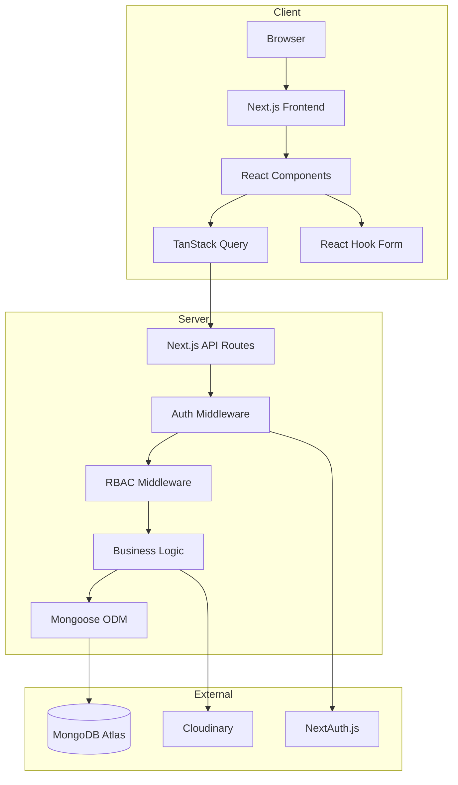
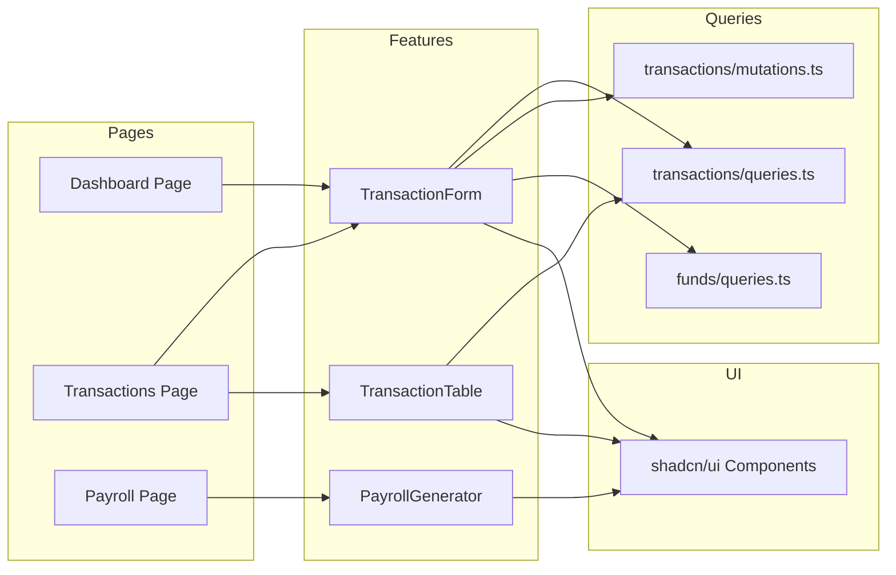
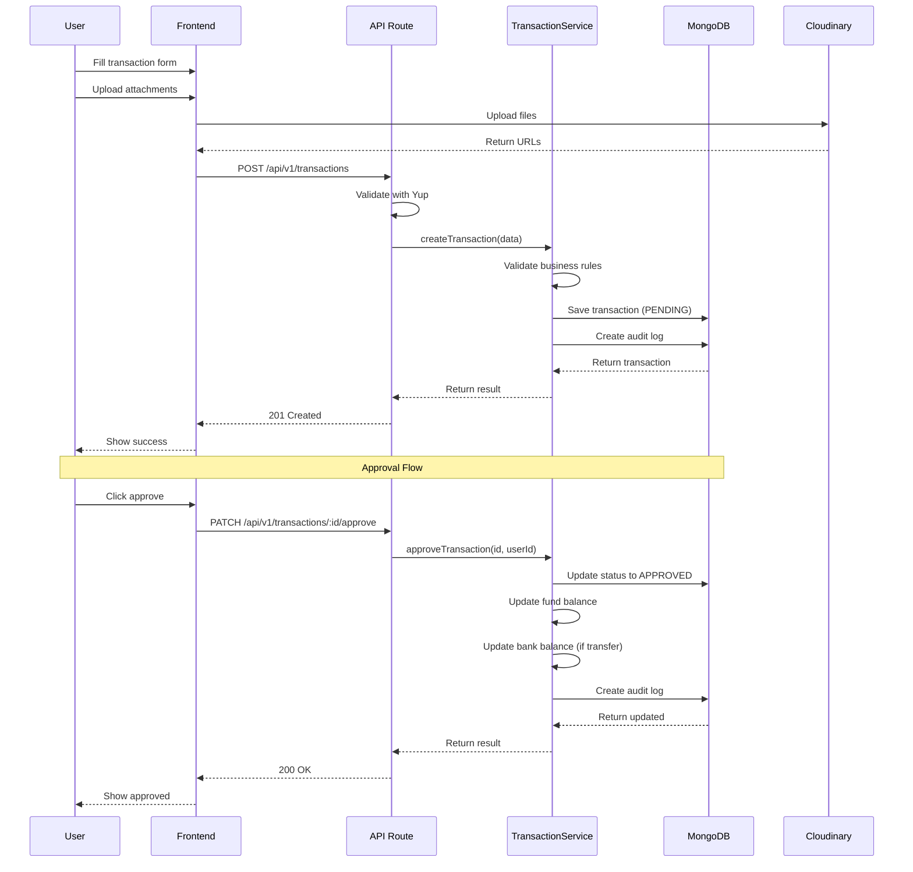
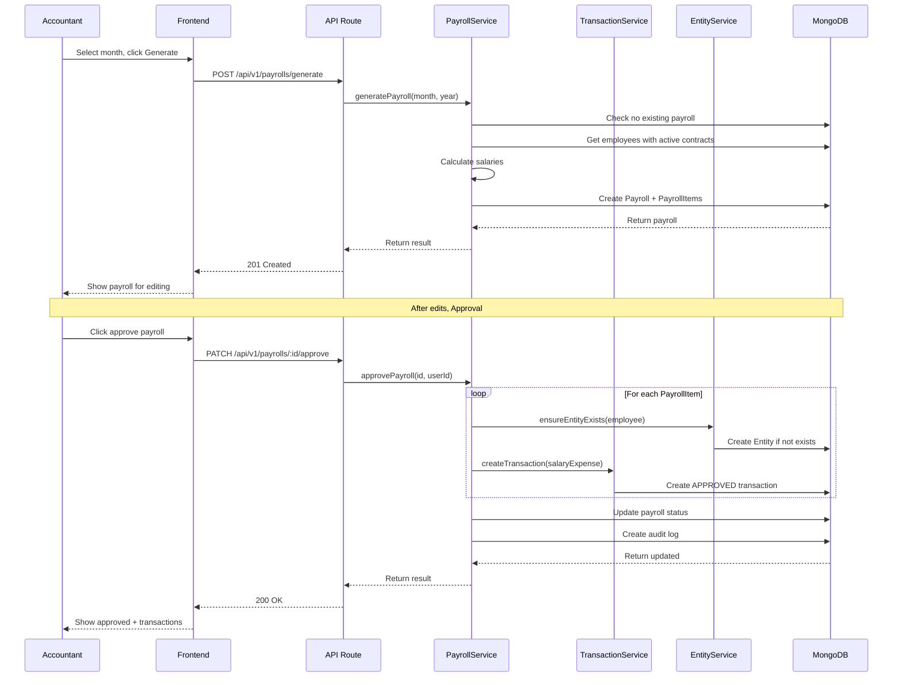
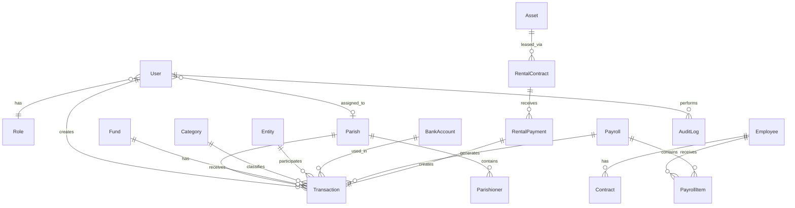

# Buon Ma Thuot Diocese Management System (GPBMT.ORG) Architecture Document

## Introduction

This document defines the technical architecture for GPBMT.ORG - Buon Ma Thuot Diocese Management System.

**PRD Reference:** docs/prd.md

### Starter Template or Existing Project
No - New project built from scratch

### Change Log
| Date | Version | Description | Author |
|------|---------|-------------|--------|
| 2026-01-30 | 1.0 | Initial architecture | @planner |

## High Level Architecture

### Technical Summary
GPBMT.ORG is a fullstack web application built with Next.js 15+ using the App Router pattern. The system follows a monolithic architecture with clear separation between presentation, business logic, and data layers. MongoDB serves as the primary database with Mongoose ODM for schema validation. Authentication is handled via NextAuth.js with JWT tokens. File uploads are managed through Cloudinary. The frontend uses shadcn/ui components with Tailwind CSS for styling, TanStack React Table for data grids, and TanStack React Query for server state management with domain-based hook organization.

### High Level Overview
- **Architecture Style:** Monolith with layered architecture
- **Repository Structure:** Monorepo (single Next.js project)
- **API Style:** REST API via Next.js API Routes
- **State Management:** TanStack React Query for server state (domain-based), React Context for UI state
- **Authentication:** NextAuth.js with JWT + RBAC middleware

### High Level Project Diagram


### Architectural and Design Patterns
- **Repository Pattern:** Mongoose models encapsulate data access logic - _Rationale:_ Clean separation, easier testing
- **Service Layer:** Business logic in dedicated service modules - _Rationale:_ Reusable logic, single responsibility
- **Middleware Chain:** Auth → RBAC → Handler - _Rationale:_ Consistent security enforcement
- **DTO Pattern:** Yup schemas for validation at API boundaries - _Rationale:_ Type-safe data transfer
- **Observer Pattern:** Mongoose middleware for audit logging - _Rationale:_ Automatic, non-intrusive logging
- **Query Keys Factory:** Centralized query key management per domain - _Rationale:_ Consistent cache invalidation, type-safe keys

## Tech Stack

### Cloud Infrastructure
- **Provider:** Vercel (primary) or any Node.js hosting
- **Database:** MongoDB Atlas (managed cloud)
- **File Storage:** Cloudinary (CDN-backed)
- **Deployment Regions:** Auto (Vercel Edge) or single region

### Technology Stack Table
| Category | Technology | Version | Purpose | Rationale |
|----------|------------|---------|---------|-----------|
| Framework | Next.js | 15.x | Fullstack React framework | App Router, Server Components, API Routes in one |
| Language | TypeScript | 5.x | Primary language | Type safety, better DX, fewer runtime errors |
| Runtime | Node.js | 20.x LTS | Server runtime | Stable LTS, required by Next.js |
| Database | MongoDB | 7.x | Document database | Flexible schema, good for hierarchical data |
| ODM | Mongoose | 8.x | MongoDB ODM | Schema validation, middleware, TypeScript support |
| Auth | NextAuth.js | 5.x | Authentication | Built for Next.js, JWT support, extensible |
| Styling | Tailwind CSS | 3.x | Utility CSS | Rapid development, consistent design |
| UI Components | shadcn/ui | latest | Component library | Accessible, customizable, Tailwind-based |
| Forms | React Hook Form | 7.x | Form management | Performance, minimal re-renders |
| Validation | Yup | 1.x | Schema validation | Declarative, integrates with RHF |
| Data Tables | TanStack Table | 8.x | Table/grid component | Headless, powerful filtering/sorting |
| Server State | TanStack Query | 5.x | Data fetching | Caching, background updates, optimistic UI |
| File Storage | Cloudinary | SDK | Image/file hosting | CDN, transformations, generous free tier |
| Icons | Lucide React | latest | Icon library | Consistent, tree-shakeable |
| Date | date-fns | 3.x | Date utilities | Lightweight, functional API |

## Data Models

### User
**Purpose:** System users with authentication and role assignment

**Key Attributes:**
- _id: ObjectId (PK)
- email: string (unique, required)
- passwordHash: string (required)
- name: string (required)
- phone: string
- role: ObjectId (ref: Role)
- parish: ObjectId (ref: Parish, for Parish Priest/Secretary)
- isActive: boolean (default: true)
- mustChangePassword: boolean (default: false)
- createdAt: Date
- updatedAt: Date

**Relationships:**
- belongs to one Role
- optionally belongs to one Parish

### Role
**Purpose:** Predefined user roles for RBAC

**Key Attributes:**
- _id: ObjectId (PK)
- name: string (enum: SUPER_ADMIN, DIOCESE_MANAGER, PARISH_PRIEST, ACCOUNTANT, PARISH_SECRETARY)
- permissions: string[] (list of permission codes)
- createdAt: Date

**Relationships:**
- has many Users

### Parish
**Purpose:** Diocese parish units

**Key Attributes:**
- _id: ObjectId (PK)
- name: string (required)
- address: string
- phone: string
- email: string
- foundingDate: Date
- isActive: boolean (default: true)
- createdAt: Date
- updatedAt: Date

**Relationships:**
- has many Parishioners
- has many Users (Parish Priest, Secretary)

### Parishioner
**Purpose:** Parish members/congregation

**Key Attributes:**
- _id: ObjectId (PK)
- parish: ObjectId (ref: Parish, required)
- fullName: string (required)
- baptismName: string
- dateOfBirth: Date
- gender: string (enum: MALE, FEMALE)
- phone: string
- address: string
- familyHead: ObjectId (ref: Parishioner, self-reference)
- createdAt: Date
- updatedAt: Date

**Relationships:**
- belongs to one Parish
- optionally belongs to family (self-reference)

### Fund
**Purpose:** Diocese financial funds (11 types in 3 groups)

**Key Attributes:**
- _id: ObjectId (PK)
- name: string (required)
- code: string (unique)
- group: string (enum: GROUP_A, GROUP_B, GROUP_C)
- description: string
- isActive: boolean (default: true)
- createdAt: Date
- updatedAt: Date

**Relationships:**
- has many Transactions

**Virtual Fields:**
- balance: computed from transactions (income - expense + adjustments)

### Category
**Purpose:** Income/expense classification categories

**Key Attributes:**
- _id: ObjectId (PK)
- name: string (required)
- type: string (enum: INCOME, EXPENSE)
- parent: ObjectId (ref: Category, self-reference)
- isSystem: boolean (default: false, prevents deletion)
- isActive: boolean (default: true)
- createdAt: Date
- updatedAt: Date

**Relationships:**
- self-referential parent-child hierarchy
- has many Transactions

### BankAccount
**Purpose:** Diocese bank accounts for transfers

**Key Attributes:**
- _id: ObjectId (PK)
- bankName: string (required)
- accountNumber: string (required)
- accountHolder: string (required)
- purpose: string
- isDefault: boolean (default: false)
- isActive: boolean (default: true)
- createdAt: Date
- updatedAt: Date

**Relationships:**
- has many Transactions (as source/destination)

**Virtual Fields:**
- balance: computed from transfer transactions

### Entity
**Purpose:** Transaction counterparties (sender/receiver)

**Key Attributes:**
- _id: ObjectId (PK)
- name: string (required)
- phone: string (required)
- email: string
- address: string
- bankName: string
- bankAccountNumber: string
- bankAccountHolder: string
- isActive: boolean (default: true)
- createdAt: Date
- updatedAt: Date

**Relationships:**
- has many Transactions

### Transaction
**Purpose:** Financial transactions (income, expense, adjustment)

**Key Attributes:**
- _id: ObjectId (PK)
- transactionNumber: string (auto-generated, unique)
- type: string (enum: INCOME, EXPENSE, ADJUSTMENT)
- fund: ObjectId (ref: Fund, required)
- category: ObjectId (ref: Category, required)
- entity: ObjectId (ref: Entity, required)
- amount: number (required, positive)
- adjustmentType: string (enum: INCREASE, DECREASE, for adjustments only)
- adjustmentReason: string (for adjustments only)
- paymentMethod: string (enum: CASH, TRANSFER)
- bankAccount: ObjectId (ref: BankAccount, required if TRANSFER)
- description: string
- transactionDate: Date (required)
- attachments: string[] (Cloudinary URLs)
- status: string (enum: PENDING, APPROVED, REJECTED)
- rejectionReason: string
- approvedBy: ObjectId (ref: User)
- approvedAt: Date
- createdBy: ObjectId (ref: User, required)
- parish: ObjectId (ref: Parish, for parish-level transactions)
- sourceType: string (enum: MANUAL, PAYROLL, RENTAL)
- sourceId: ObjectId (ref to Payroll or RentalPayment)
- createdAt: Date
- updatedAt: Date

**Relationships:**
- belongs to Fund, Category, Entity
- optionally belongs to BankAccount
- belongs to User (creator, approver)
- optionally linked to Payroll or RentalPayment

### Employee
**Purpose:** Diocese staff members

**Key Attributes:**
- _id: ObjectId (PK)
- fullName: string (required)
- dateOfBirth: Date
- gender: string (enum: MALE, FEMALE)
- phone: string (required)
- email: string
- address: string
- position: string (required)
- department: string
- bankName: string
- bankAccountNumber: string
- bankAccountHolder: string
- isActive: boolean (default: true)
- createdAt: Date
- updatedAt: Date

**Relationships:**
- has many Contracts
- has many PayrollItems

### Contract
**Purpose:** Employee labor contracts

**Key Attributes:**
- _id: ObjectId (PK)
- employee: ObjectId (ref: Employee, required)
- type: string (enum: FIXED_TERM, INDEFINITE)
- baseSalary: number (required)
- startDate: Date (required)
- endDate: Date (required for FIXED_TERM)
- isActive: boolean (default: true)
- createdAt: Date
- updatedAt: Date

**Relationships:**
- belongs to Employee

### Payroll
**Purpose:** Monthly payroll batch

**Key Attributes:**
- _id: ObjectId (PK)
- month: number (1-12, required)
- year: number (required)
- status: string (enum: DRAFT, APPROVED)
- totalAmount: number (computed)
- approvedBy: ObjectId (ref: User)
- approvedAt: Date
- createdBy: ObjectId (ref: User, required)
- createdAt: Date
- updatedAt: Date

**Relationships:**
- has many PayrollItems
- generates many Transactions upon approval

**Indexes:**
- unique compound index on (month, year)

### PayrollItem
**Purpose:** Individual employee salary in payroll

**Key Attributes:**
- _id: ObjectId (PK)
- payroll: ObjectId (ref: Payroll, required)
- employee: ObjectId (ref: Employee, required)
- baseSalary: number (from contract)
- allowances: number (default: 0)
- deductions: number (default: 0)
- advances: number (default: 0)
- netSalary: number (computed: base + allowances - deductions - advances)
- createdAt: Date
- updatedAt: Date

**Relationships:**
- belongs to Payroll
- belongs to Employee

### Asset
**Purpose:** Diocese property/assets

**Key Attributes:**
- _id: ObjectId (PK)
- name: string (required)
- type: string (enum: LAND, BUILDING, VEHICLE, EQUIPMENT, OTHER)
- area: number (for land/building)
- areaUnit: string (enum: SQM, HECTARE)
- value: number
- address: string
- description: string
- status: string (enum: AVAILABLE, RENTED, IN_USE)
- images: string[] (Cloudinary URLs)
- documents: string[] (Cloudinary URLs)
- createdAt: Date
- updatedAt: Date

**Relationships:**
- has many RentalContracts

### RentalContract
**Purpose:** Asset rental agreements

**Key Attributes:**
- _id: ObjectId (PK)
- asset: ObjectId (ref: Asset, required)
- tenantName: string (required)
- tenantPhone: string (required)
- tenantEmail: string
- tenantAddress: string
- tenantBankName: string
- tenantBankAccountNumber: string
- tenantBankAccountHolder: string
- monthlyRent: number (required)
- deposit: number
- startDate: Date (required)
- endDate: Date (required)
- fund: ObjectId (ref: Fund, default fund for payments)
- documents: string[] (Cloudinary URLs)
- isActive: boolean (default: true)
- createdAt: Date
- updatedAt: Date

**Relationships:**
- belongs to Asset
- belongs to Fund (default)
- has many RentalPayments

### RentalPayment
**Purpose:** Rental payment records

**Key Attributes:**
- _id: ObjectId (PK)
- rentalContract: ObjectId (ref: RentalContract, required)
- paymentDate: Date (required)
- amount: number (required)
- paymentMethod: string (enum: CASH, TRANSFER)
- bankAccount: ObjectId (ref: BankAccount)
- fund: ObjectId (ref: Fund)
- transaction: ObjectId (ref: Transaction, auto-created)
- createdBy: ObjectId (ref: User, required)
- createdAt: Date
- updatedAt: Date

**Relationships:**
- belongs to RentalContract
- creates one Transaction

### AuditLog
**Purpose:** System activity tracking

**Key Attributes:**
- _id: ObjectId (PK)
- user: ObjectId (ref: User, required)
- action: string (enum: CREATE, UPDATE, DELETE)
- entityType: string (e.g., 'Transaction', 'Payroll')
- entityId: ObjectId
- oldValue: Mixed (JSON of previous state)
- newValue: Mixed (JSON of new state)
- ipAddress: string
- userAgent: string
- createdAt: Date

**Relationships:**
- belongs to User
- references any entity

### TypeScript Interfaces
```typescript
// Enums
export enum UserRole {
  SUPER_ADMIN = 'SUPER_ADMIN',
  DIOCESE_MANAGER = 'DIOCESE_MANAGER',
  PARISH_PRIEST = 'PARISH_PRIEST',
  ACCOUNTANT = 'ACCOUNTANT',
  PARISH_SECRETARY = 'PARISH_SECRETARY',
}

export enum TransactionType {
  INCOME = 'INCOME',
  EXPENSE = 'EXPENSE',
  ADJUSTMENT = 'ADJUSTMENT',
}

export enum TransactionStatus {
  PENDING = 'PENDING',
  APPROVED = 'APPROVED',
  REJECTED = 'REJECTED',
}

export enum PaymentMethod {
  CASH = 'CASH',
  TRANSFER = 'TRANSFER',
}

export enum FundGroup {
  GROUP_A = 'GROUP_A', // CBCV funds
  GROUP_B = 'GROUP_B', // Diocese Office funds
  GROUP_C = 'GROUP_C', // Internal funds
}

// Core interfaces
export interface IUser {
  _id: string;
  email: string;
  name: string;
  phone?: string;
  role: IRole | string;
  parish?: IParish | string;
  isActive: boolean;
  mustChangePassword: boolean;
  createdAt: Date;
  updatedAt: Date;
}

export interface ITransaction {
  _id: string;
  transactionNumber: string;
  type: TransactionType;
  fund: IFund | string;
  category: ICategory | string;
  entity: IEntity | string;
  amount: number;
  adjustmentType?: 'INCREASE' | 'DECREASE';
  adjustmentReason?: string;
  paymentMethod: PaymentMethod;
  bankAccount?: IBankAccount | string;
  description?: string;
  transactionDate: Date;
  attachments: string[];
  status: TransactionStatus;
  rejectionReason?: string;
  approvedBy?: IUser | string;
  approvedAt?: Date;
  createdBy: IUser | string;
  parish?: IParish | string;
  sourceType?: 'MANUAL' | 'PAYROLL' | 'RENTAL';
  sourceId?: string;
  createdAt: Date;
  updatedAt: Date;
}
```

## Components

### API Layer (Next.js API Routes)
**Responsibility:** Handle HTTP requests, validate input, delegate to services
**Key Interfaces:** REST endpoints under `/api/v1/*`
**Dependencies:** Auth middleware, Services
**Technology Stack:** Next.js API Routes, Yup validation

### Auth Middleware
**Responsibility:** Verify JWT tokens, attach user to request
**Key Interfaces:** `withAuth()` HOC for API routes
**Dependencies:** NextAuth.js, JWT
**Technology Stack:** NextAuth.js v5

### RBAC Middleware
**Responsibility:** Check user permissions for route access
**Key Interfaces:** `withPermission(permissions[])` HOC
**Dependencies:** Auth Middleware, Role permissions map
**Technology Stack:** Custom middleware

### Service Layer
**Responsibility:** Business logic, validation rules, cross-entity operations
**Key Interfaces:** `TransactionService`, `PayrollService`, `AuditService`
**Dependencies:** Mongoose models
**Technology Stack:** TypeScript classes/modules

### Mongoose Models
**Responsibility:** Data access, schema validation, virtuals, middleware
**Key Interfaces:** Model classes with static/instance methods
**Dependencies:** MongoDB connection
**Technology Stack:** Mongoose 8.x

### React Query Hooks (Domain-Based)
**Responsibility:** Data fetching, caching, mutations organized by domain
**Key Interfaces:**
- `keys.ts` - Query key factories for cache management
- `queries.ts` - useQuery hooks (list, detail, search)
- `mutations.ts` - useMutation hooks (create, update, delete, approve)
**Dependencies:** TanStack Query, API client
**Technology Stack:** TanStack Query v5

### UI Components (shadcn/ui)
**Responsibility:** Reusable UI primitives
**Key Interfaces:** Button, Dialog, Form, Table, etc.
**Dependencies:** Tailwind CSS, Radix UI
**Technology Stack:** shadcn/ui, Tailwind CSS

### Feature Components
**Responsibility:** Business-specific UI (TransactionForm, PayrollTable)
**Key Interfaces:** Props-driven React components
**Dependencies:** UI Components, React Query hooks, React Hook Form
**Technology Stack:** React 19, TypeScript

### Component Diagrams


## External APIs

### Cloudinary API
- **Purpose:** Image and document storage with CDN delivery
- **Documentation:** https://cloudinary.com/documentation
- **Authentication:** API Key + Secret (server-side), Upload preset (client-side)
- **Rate Limits:** Based on plan (free: 25 credits/month)
- **Key Operations:** Upload, transform, delete

### MongoDB Atlas API
- **Purpose:** Managed database hosting
- **Documentation:** https://www.mongodb.com/docs/atlas
- **Authentication:** Connection string with credentials
- **Rate Limits:** Based on cluster tier

## Core Workflows

### Transaction Creation and Approval


### Payroll Generation and Transaction Creation


## REST API Spec

### API Style
REST with JSON payloads

### Base URL
`/api/v1`

### Authentication
JWT Bearer token via NextAuth.js session

### Common Response Format
```typescript
// Success
{
  "success": true,
  "data": { ... },
  "meta": { "total": 100, "page": 1, "limit": 20 }
}

// Error
{
  "success": false,
  "error": {
    "code": "VALIDATION_ERROR",
    "message": "Invalid input",
    "details": [...]
  }
}
```

### Endpoints

#### Auth
| Method | Endpoint | Description | Auth |
|--------|----------|-------------|------|
| POST | /auth/login | Login with email/password | No |
| POST | /auth/logout | Logout and invalidate session | Yes |
| GET | /auth/me | Get current user info | Yes |
| PATCH | /auth/change-password | Change password | Yes |

#### Users
| Method | Endpoint | Description | Auth | Roles |
|--------|----------|-------------|------|-------|
| GET | /users | List users (paginated) | Yes | SUPER_ADMIN |
| POST | /users | Create user | Yes | SUPER_ADMIN |
| GET | /users/:id | Get user details | Yes | SUPER_ADMIN |
| PATCH | /users/:id | Update user | Yes | SUPER_ADMIN |
| DELETE | /users/:id | Deactivate user | Yes | SUPER_ADMIN |
| POST | /users/:id/reset-password | Reset password | Yes | SUPER_ADMIN |

#### Parishes
| Method | Endpoint | Description | Auth | Roles |
|--------|----------|-------------|------|-------|
| GET | /parishes | List parishes | Yes | All |
| POST | /parishes | Create parish | Yes | SUPER_ADMIN, DIOCESE_MANAGER |
| GET | /parishes/:id | Get parish details | Yes | All |
| PATCH | /parishes/:id | Update parish | Yes | SUPER_ADMIN, DIOCESE_MANAGER |
| DELETE | /parishes/:id | Delete parish | Yes | SUPER_ADMIN |

#### Parishioners
| Method | Endpoint | Description | Auth | Roles |
|--------|----------|-------------|------|-------|
| GET | /parishioners | List parishioners | Yes | All (filtered by parish for PP/PS) |
| POST | /parishioners | Create parishioner | Yes | PP, PS, SUPER_ADMIN |
| GET | /parishioners/:id | Get parishioner | Yes | All |
| PATCH | /parishioners/:id | Update parishioner | Yes | PP, PS, SUPER_ADMIN |
| DELETE | /parishioners/:id | Delete parishioner | Yes | SUPER_ADMIN |

#### Funds
| Method | Endpoint | Description | Auth | Roles |
|--------|----------|-------------|------|-------|
| GET | /funds | List funds with balances | Yes | All |
| POST | /funds | Create fund | Yes | SUPER_ADMIN, ACCOUNTANT |
| GET | /funds/:id | Get fund with balance | Yes | All |
| PATCH | /funds/:id | Update fund | Yes | SUPER_ADMIN, ACCOUNTANT |

#### Categories
| Method | Endpoint | Description | Auth | Roles |
|--------|----------|-------------|------|-------|
| GET | /categories | List categories | Yes | All |
| POST | /categories | Create category | Yes | ACCOUNTANT, SUPER_ADMIN |
| PATCH | /categories/:id | Update category | Yes | ACCOUNTANT, SUPER_ADMIN |
| DELETE | /categories/:id | Delete category | Yes | SUPER_ADMIN |

#### Bank Accounts
| Method | Endpoint | Description | Auth | Roles |
|--------|----------|-------------|------|-------|
| GET | /bank-accounts | List accounts with balances | Yes | ACCOUNTANT, SUPER_ADMIN, DM |
| POST | /bank-accounts | Create account | Yes | ACCOUNTANT, SUPER_ADMIN |
| PATCH | /bank-accounts/:id | Update account | Yes | ACCOUNTANT, SUPER_ADMIN |

#### Entities
| Method | Endpoint | Description | Auth | Roles |
|--------|----------|-------------|------|-------|
| GET | /entities | List/search entities | Yes | All |
| POST | /entities | Create entity | Yes | All |
| PATCH | /entities/:id | Update entity | Yes | ACCOUNTANT, SUPER_ADMIN |

#### Transactions
| Method | Endpoint | Description | Auth | Roles |
|--------|----------|-------------|------|-------|
| GET | /transactions | List transactions (filtered) | Yes | All (filtered by parish) |
| POST | /transactions | Create transaction | Yes | All (role-based limits) |
| GET | /transactions/:id | Get transaction | Yes | All |
| PATCH | /transactions/:id | Update transaction | Yes | Creator (if PENDING) |
| DELETE | /transactions/:id | Delete transaction | Yes | Creator (if PENDING) |
| PATCH | /transactions/:id/approve | Approve transaction | Yes | SUPER_ADMIN, DM |
| PATCH | /transactions/:id/reject | Reject transaction | Yes | SUPER_ADMIN, DM |
| PATCH | /transactions/:id/cancel-approval | Cancel approval | Yes | SUPER_ADMIN, DM |
| GET | /transactions/export | Export to CSV | Yes | ACCOUNTANT, SUPER_ADMIN |

#### Employees
| Method | Endpoint | Description | Auth | Roles |
|--------|----------|-------------|------|-------|
| GET | /employees | List employees | Yes | ACCOUNTANT, SUPER_ADMIN, DM |
| POST | /employees | Create employee | Yes | ACCOUNTANT, SUPER_ADMIN |
| GET | /employees/:id | Get employee | Yes | ACCOUNTANT, SUPER_ADMIN, DM |
| PATCH | /employees/:id | Update employee | Yes | ACCOUNTANT, SUPER_ADMIN |

#### Contracts
| Method | Endpoint | Description | Auth | Roles |
|--------|----------|-------------|------|-------|
| GET | /employees/:id/contracts | List contracts | Yes | ACCOUNTANT, SUPER_ADMIN |
| POST | /employees/:id/contracts | Create contract | Yes | ACCOUNTANT, SUPER_ADMIN |
| PATCH | /contracts/:id | Update contract | Yes | ACCOUNTANT, SUPER_ADMIN |

#### Payrolls
| Method | Endpoint | Description | Auth | Roles |
|--------|----------|-------------|------|-------|
| GET | /payrolls | List payrolls | Yes | ACCOUNTANT, SUPER_ADMIN, DM |
| POST | /payrolls/generate | Generate payroll | Yes | ACCOUNTANT |
| GET | /payrolls/:id | Get payroll with items | Yes | ACCOUNTANT, SUPER_ADMIN, DM |
| PATCH | /payrolls/:id/items | Update payroll items | Yes | ACCOUNTANT (if DRAFT) |
| PATCH | /payrolls/:id/approve | Approve payroll | Yes | SUPER_ADMIN, DM |

#### Assets
| Method | Endpoint | Description | Auth | Roles |
|--------|----------|-------------|------|-------|
| GET | /assets | List assets | Yes | ACCOUNTANT, SUPER_ADMIN, DM, PP |
| POST | /assets | Create asset | Yes | ACCOUNTANT, SUPER_ADMIN |
| GET | /assets/:id | Get asset | Yes | All |
| PATCH | /assets/:id | Update asset | Yes | ACCOUNTANT, SUPER_ADMIN |
| DELETE | /assets/:id | Delete asset | Yes | SUPER_ADMIN |

#### Rental Contracts
| Method | Endpoint | Description | Auth | Roles |
|--------|----------|-------------|------|-------|
| GET | /rental-contracts | List contracts | Yes | ACCOUNTANT, SUPER_ADMIN, DM |
| POST | /rental-contracts | Create contract | Yes | ACCOUNTANT, SUPER_ADMIN |
| GET | /rental-contracts/:id | Get contract | Yes | All |
| PATCH | /rental-contracts/:id | Update contract | Yes | ACCOUNTANT, SUPER_ADMIN |
| POST | /rental-contracts/:id/payments | Record payment | Yes | ACCOUNTANT |

#### Audit Logs
| Method | Endpoint | Description | Auth | Roles |
|--------|----------|-------------|------|-------|
| GET | /audit-logs | List audit logs | Yes | SUPER_ADMIN |
| GET | /audit-logs/:id | Get audit log detail | Yes | SUPER_ADMIN |

#### Dashboard
| Method | Endpoint | Description | Auth | Roles |
|--------|----------|-------------|------|-------|
| GET | /dashboard/stats | Get dashboard stats | Yes | All (role-filtered) |
| GET | /dashboard/pending | Get pending approvals | Yes | SUPER_ADMIN, DM |

## Database Schema

### Collections Overview

#### users
| Field | Type | Constraints | Description |
|-------|------|-------------|-------------|
| _id | ObjectId | PK | Primary key |
| email | String | unique, required | Login email |
| passwordHash | String | required | Bcrypt hash |
| name | String | required | Display name |
| phone | String | | Contact phone |
| role | ObjectId | ref: roles | User role |
| parish | ObjectId | ref: parishes | Assigned parish |
| isActive | Boolean | default: true | Account status |
| mustChangePassword | Boolean | default: false | Force password change |
| createdAt | Date | | Auto timestamp |
| updatedAt | Date | | Auto timestamp |

#### transactions
| Field | Type | Constraints | Description |
|-------|------|-------------|-------------|
| _id | ObjectId | PK | Primary key |
| transactionNumber | String | unique | Auto-generated code |
| type | String | enum | INCOME/EXPENSE/ADJUSTMENT |
| fund | ObjectId | ref: funds, required | Associated fund |
| category | ObjectId | ref: categories, required | Classification |
| entity | ObjectId | ref: entities, required | Counterparty |
| amount | Number | required, min: 0 | Transaction amount |
| adjustmentType | String | enum | INCREASE/DECREASE |
| adjustmentReason | String | | Reason for adjustment |
| paymentMethod | String | enum, required | CASH/TRANSFER |
| bankAccount | ObjectId | ref: bank_accounts | For transfers |
| description | String | | Transaction notes |
| transactionDate | Date | required | When occurred |
| attachments | [String] | | Cloudinary URLs |
| status | String | enum, default: PENDING | Approval status |
| rejectionReason | String | | If rejected |
| approvedBy | ObjectId | ref: users | Approver |
| approvedAt | Date | | Approval timestamp |
| createdBy | ObjectId | ref: users, required | Creator |
| parish | ObjectId | ref: parishes | For parish transactions |
| sourceType | String | enum | MANUAL/PAYROLL/RENTAL |
| sourceId | ObjectId | | Reference to source |
| createdAt | Date | | Auto timestamp |
| updatedAt | Date | | Auto timestamp |

### Indexes
```javascript
// users
{ email: 1 } // unique
{ role: 1 }
{ parish: 1 }

// transactions
{ transactionNumber: 1 } // unique
{ type: 1, status: 1 }
{ fund: 1 }
{ category: 1 }
{ entity: 1 }
{ transactionDate: -1 }
{ status: 1, createdAt: -1 }
{ parish: 1 }
{ createdBy: 1 }
{ sourceType: 1, sourceId: 1 }

// payrolls
{ month: 1, year: 1 } // unique compound

// audit_logs
{ user: 1 }
{ entityType: 1, entityId: 1 }
{ createdAt: -1 }
{ action: 1 }
```

### Entity Relationship Diagram


## Source Tree

```
gpbmt-org/
├── src/
│   ├── app/                          # Next.js App Router
│   │   ├── (auth)/                   # Auth pages group
│   │   │   ├── login/
│   │   │   │   └── page.tsx
│   │   │   └── layout.tsx
│   │   ├── (dashboard)/              # Protected pages group
│   │   │   ├── dashboard/
│   │   │   │   └── page.tsx
│   │   │   ├── parishes/
│   │   │   │   ├── page.tsx
│   │   │   │   └── [id]/
│   │   │   │       └── page.tsx
│   │   │   ├── parishioners/
│   │   │   │   └── page.tsx
│   │   │   ├── finance/
│   │   │   │   ├── funds/
│   │   │   │   │   └── page.tsx
│   │   │   │   ├── categories/
│   │   │   │   │   └── page.tsx
│   │   │   │   ├── bank-accounts/
│   │   │   │   │   └── page.tsx
│   │   │   │   ├── entities/
│   │   │   │   │   └── page.tsx
│   │   │   │   └── transactions/
│   │   │   │       ├── page.tsx
│   │   │   │       └── [id]/
│   │   │   │           └── page.tsx
│   │   │   ├── hr/
│   │   │   │   ├── employees/
│   │   │   │   │   └── page.tsx
│   │   │   │   └── payrolls/
│   │   │   │       └── page.tsx
│   │   │   ├── administration/
│   │   │   │   ├── assets/
│   │   │   │   │   └── page.tsx
│   │   │   │   └── rental-contracts/
│   │   │   │       └── page.tsx
│   │   │   ├── system/
│   │   │   │   ├── users/
│   │   │   │   │   └── page.tsx
│   │   │   │   └── audit-logs/
│   │   │   │       └── page.tsx
│   │   │   └── layout.tsx
│   │   ├── api/
│   │   │   ├── auth/
│   │   │   │   └── [...nextauth]/
│   │   │   │       └── route.ts
│   │   │   └── v1/
│   │   │       ├── users/
│   │   │       │   ├── route.ts
│   │   │       │   └── [id]/
│   │   │       │       └── route.ts
│   │   │       ├── parishes/
│   │   │       │   └── route.ts
│   │   │       ├── parishioners/
│   │   │       │   └── route.ts
│   │   │       ├── funds/
│   │   │       │   └── route.ts
│   │   │       ├── categories/
│   │   │       │   └── route.ts
│   │   │       ├── bank-accounts/
│   │   │       │   └── route.ts
│   │   │       ├── entities/
│   │   │       │   └── route.ts
│   │   │       ├── transactions/
│   │   │       │   ├── route.ts
│   │   │       │   ├── export/
│   │   │       │   │   └── route.ts
│   │   │       │   └── [id]/
│   │   │       │       ├── route.ts
│   │   │       │       ├── approve/
│   │   │       │       │   └── route.ts
│   │   │       │       └── reject/
│   │   │       │           └── route.ts
│   │   │       ├── employees/
│   │   │       │   └── route.ts
│   │   │       ├── payrolls/
│   │   │       │   ├── route.ts
│   │   │       │   └── generate/
│   │   │       │       └── route.ts
│   │   │       ├── assets/
│   │   │       │   └── route.ts
│   │   │       ├── rental-contracts/
│   │   │       │   └── route.ts
│   │   │       ├── audit-logs/
│   │   │       │   └── route.ts
│   │   │       └── dashboard/
│   │   │           └── route.ts
│   │   ├── globals.css
│   │   └── layout.tsx
│   │
│   ├── components/
│   │   ├── ui/                       # shadcn/ui components
│   │   │   ├── button.tsx
│   │   │   ├── dialog.tsx
│   │   │   ├── form.tsx
│   │   │   ├── input.tsx
│   │   │   ├── select.tsx
│   │   │   ├── table.tsx
│   │   │   └── ...
│   │   ├── layout/
│   │   │   ├── sidebar.tsx
│   │   │   ├── header.tsx
│   │   │   └── breadcrumb.tsx
│   │   ├── forms/
│   │   │   ├── transaction-form.tsx
│   │   │   ├── parish-form.tsx
│   │   │   ├── employee-form.tsx
│   │   │   └── ...
│   │   ├── tables/
│   │   │   ├── transactions-table.tsx
│   │   │   ├── parishes-table.tsx
│   │   │   └── ...
│   │   └── shared/
│   │       ├── entity-select.tsx
│   │       ├── file-upload.tsx
│   │       ├── date-range-picker.tsx
│   │       └── status-badge.tsx
│   │
│   ├── queries/                      # React Query hooks (domain-based)
│   │   ├── transactions/
│   │   │   ├── keys.ts               # Query keys factory
│   │   │   ├── queries.ts            # useTransactions, useTransaction
│   │   │   ├── mutations.ts          # useCreateTransaction, useApproveTransaction
│   │   │   └── index.ts              # Barrel export
│   │   ├── funds/
│   │   │   ├── keys.ts
│   │   │   ├── queries.ts            # useFunds, useFund
│   │   │   ├── mutations.ts          # useCreateFund, useUpdateFund
│   │   │   └── index.ts
│   │   ├── categories/
│   │   │   ├── keys.ts
│   │   │   ├── queries.ts
│   │   │   ├── mutations.ts
│   │   │   └── index.ts
│   │   ├── bank-accounts/
│   │   │   ├── keys.ts
│   │   │   ├── queries.ts
│   │   │   ├── mutations.ts
│   │   │   └── index.ts
│   │   ├── entities/
│   │   │   ├── keys.ts
│   │   │   ├── queries.ts
│   │   │   ├── mutations.ts
│   │   │   └── index.ts
│   │   ├── parishes/
│   │   │   ├── keys.ts
│   │   │   ├── queries.ts
│   │   │   ├── mutations.ts
│   │   │   └── index.ts
│   │   ├── parishioners/
│   │   │   ├── keys.ts
│   │   │   ├── queries.ts
│   │   │   ├── mutations.ts
│   │   │   └── index.ts
│   │   ├── employees/
│   │   │   ├── keys.ts
│   │   │   ├── queries.ts
│   │   │   ├── mutations.ts
│   │   │   └── index.ts
│   │   ├── payrolls/
│   │   │   ├── keys.ts
│   │   │   ├── queries.ts
│   │   │   ├── mutations.ts
│   │   │   └── index.ts
│   │   ├── assets/
│   │   │   ├── keys.ts
│   │   │   ├── queries.ts
│   │   │   ├── mutations.ts
│   │   │   └── index.ts
│   │   ├── rental-contracts/
│   │   │   ├── keys.ts
│   │   │   ├── queries.ts
│   │   │   ├── mutations.ts
│   │   │   └── index.ts
│   │   ├── users/
│   │   │   ├── keys.ts
│   │   │   ├── queries.ts
│   │   │   ├── mutations.ts
│   │   │   └── index.ts
│   │   ├── audit-logs/
│   │   │   ├── keys.ts
│   │   │   ├── queries.ts
│   │   │   └── index.ts
│   │   ├── dashboard/
│   │   │   ├── keys.ts
│   │   │   ├── queries.ts
│   │   │   └── index.ts
│   │   └── auth/
│   │       ├── keys.ts
│   │       ├── queries.ts            # useCurrentUser
│   │       ├── mutations.ts          # useLogin, useLogout
│   │       └── index.ts
│   │
│   ├── lib/
│   │   ├── db/
│   │   │   ├── connection.ts         # MongoDB connection
│   │   │   └── models/
│   │   │       ├── user.model.ts
│   │   │       ├── role.model.ts
│   │   │       ├── parish.model.ts
│   │   │       ├── parishioner.model.ts
│   │   │       ├── fund.model.ts
│   │   │       ├── category.model.ts
│   │   │       ├── bank-account.model.ts
│   │   │       ├── entity.model.ts
│   │   │       ├── transaction.model.ts
│   │   │       ├── employee.model.ts
│   │   │       ├── contract.model.ts
│   │   │       ├── payroll.model.ts
│   │   │       ├── payroll-item.model.ts
│   │   │       ├── asset.model.ts
│   │   │       ├── rental-contract.model.ts
│   │   │       ├── rental-payment.model.ts
│   │   │       ├── audit-log.model.ts
│   │   │       └── index.ts
│   │   ├── services/
│   │   │   ├── transaction.service.ts
│   │   │   ├── payroll.service.ts
│   │   │   ├── audit.service.ts
│   │   │   ├── cloudinary.service.ts
│   │   │   └── ...
│   │   ├── auth/
│   │   │   ├── auth.config.ts        # NextAuth config
│   │   │   ├── auth.ts               # Auth utilities
│   │   │   └── rbac.ts               # RBAC middleware
│   │   ├── validations/
│   │   │   ├── transaction.schema.ts
│   │   │   ├── user.schema.ts
│   │   │   └── ...
│   │   ├── api/
│   │   │   ├── client.ts             # API client for React Query
│   │   │   ├── endpoints.ts          # API endpoint constants
│   │   │   └── types.ts              # API request/response types
│   │   └── utils/
│   │       ├── api-response.ts
│   │       ├── api-error.ts
│   │       └── helpers.ts
│   │
│   ├── providers/
│   │   ├── query-provider.tsx
│   │   ├── auth-provider.tsx
│   │   └── theme-provider.tsx
│   │
│   └── types/
│       ├── index.ts
│       ├── api.types.ts
│       └── models.types.ts
│
├── public/
│   └── ...
│
├── tests/
│   ├── unit/
│   │   └── services/
│   │       └── transaction.service.test.ts
│   └── integration/
│       └── api/
│           └── transactions.test.ts
│
├── scripts/
│   └── seed.ts                       # Database seeding
│
├── .env.local.example
├── .eslintrc.json
├── .prettierrc
├── components.json                   # shadcn/ui config
├── next.config.js
├── package.json
├── tailwind.config.ts
├── tsconfig.json
└── README.md
```

## Query Keys Pattern

### Keys Factory Example (transactions/keys.ts)
```typescript
export const transactionKeys = {
  all: ['transactions'] as const,
  lists: () => [...transactionKeys.all, 'list'] as const,
  list: (filters: TransactionFilters) => [...transactionKeys.lists(), filters] as const,
  details: () => [...transactionKeys.all, 'detail'] as const,
  detail: (id: string) => [...transactionKeys.details(), id] as const,
  pending: () => [...transactionKeys.all, 'pending'] as const,
};
```

### Queries Example (transactions/queries.ts)
```typescript
import { useQuery } from '@tanstack/react-query';
import { transactionKeys } from './keys';
import { apiClient } from '@/lib/api/client';

export function useTransactions(filters: TransactionFilters) {
  return useQuery({
    queryKey: transactionKeys.list(filters),
    queryFn: () => apiClient.get('/transactions', { params: filters }),
  });
}

export function useTransaction(id: string) {
  return useQuery({
    queryKey: transactionKeys.detail(id),
    queryFn: () => apiClient.get(`/transactions/${id}`),
    enabled: !!id,
  });
}
```

### Mutations Example (transactions/mutations.ts)
```typescript
import { useMutation, useQueryClient } from '@tanstack/react-query';
import { transactionKeys } from './keys';
import { fundKeys } from '../funds/keys';
import { apiClient } from '@/lib/api/client';

export function useCreateTransaction() {
  const queryClient = useQueryClient();

  return useMutation({
    mutationFn: (data: CreateTransactionInput) =>
      apiClient.post('/transactions', data),
    onSuccess: () => {
      queryClient.invalidateQueries({ queryKey: transactionKeys.lists() });
    },
  });
}

export function useApproveTransaction() {
  const queryClient = useQueryClient();

  return useMutation({
    mutationFn: (id: string) =>
      apiClient.patch(`/transactions/${id}/approve`),
    onSuccess: (_, id) => {
      queryClient.invalidateQueries({ queryKey: transactionKeys.detail(id) });
      queryClient.invalidateQueries({ queryKey: transactionKeys.lists() });
      queryClient.invalidateQueries({ queryKey: fundKeys.all });
    },
  });
}
```

## Infrastructure and Deployment

### Infrastructure as Code
- **Tool:** Vercel CLI or Docker Compose
- **Location:** `/docker` (if using Docker)

### Deployment Strategy
- **Strategy:** Blue-Green via Vercel automatic deployments
- **CI/CD Platform:** GitHub Actions + Vercel

### Environments
- **Development:** Local with MongoDB Atlas dev cluster
- **Staging:** Vercel Preview deployments (per PR)
- **Production:** Vercel Production with MongoDB Atlas production cluster

### Environment Promotion Flow
```
Local Development → PR Preview (Staging) → Main Branch (Production)
```

### Rollback Strategy
- **Primary Method:** Vercel instant rollback to previous deployment
- **Trigger Conditions:** Error rate spike, failed health checks, manual trigger

### Environment Variables
```bash
# Database
MONGODB_URI=mongodb+srv://...

# NextAuth
NEXTAUTH_URL=https://gpbmt.org
NEXTAUTH_SECRET=...

# Cloudinary
CLOUDINARY_CLOUD_NAME=...
CLOUDINARY_API_KEY=...
CLOUDINARY_API_SECRET=...
CLOUDINARY_UPLOAD_PRESET=...

# App
NEXT_PUBLIC_APP_URL=https://gpbmt.org
```

## Error Handling Strategy

### General Approach
- **Error Model:** Structured error responses with code, message, details
- **Exception Hierarchy:** Custom ApiError class extending Error

### Logging Standards
- **Library:** Built-in console + Vercel logs (or Pino for production)
- **Format:** JSON structured logs
- **Levels:** DEBUG, INFO, WARN, ERROR

### Error Handling Patterns

#### API Route Errors
```typescript
try {
  // handler logic
} catch (error) {
  if (error instanceof ApiError) {
    return NextResponse.json(
      { success: false, error: error.toJSON() },
      { status: error.statusCode }
    );
  }
  console.error('Unexpected error:', error);
  return NextResponse.json(
    { success: false, error: { code: 'INTERNAL_ERROR', message: 'Something went wrong' } },
    { status: 500 }
  );
}
```

#### External API Errors (Cloudinary)
- **Retry Policy:** 3 retries with exponential backoff
- **Fallback:** Store file reference, retry upload in background job

#### Business Logic Errors
- **Custom Exceptions:** ValidationError, NotFoundError, ForbiddenError, ConflictError
- **Error Codes:** VALIDATION_ERROR, NOT_FOUND, FORBIDDEN, CONFLICT, INTERNAL_ERROR

## Coding Standards

### Core Standards
- **Language:** TypeScript 5.x (strict mode)
- **Runtime:** Node.js 20.x LTS
- **Style & Linting:** ESLint + Prettier

### Naming Conventions
| Element | Convention | Example |
|---------|------------|---------|
| Files (components) | kebab-case | transaction-form.tsx |
| Files (utils) | kebab-case | api-response.ts |
| Components | PascalCase | TransactionForm |
| Functions | camelCase | createTransaction |
| Constants | SCREAMING_SNAKE | MAX_FILE_SIZE |
| Types/Interfaces | PascalCase with I prefix | ITransaction |
| Enums | PascalCase | TransactionType |
| Database collections | snake_case plural | transactions |
| API routes | kebab-case | /api/v1/bank-accounts |
| Query keys | camelCase with Keys suffix | transactionKeys |

### Critical Rules
- **No `any` type:** Use proper typing or `unknown` with type guards
- **Explicit return types:** All functions must have explicit return types
- **No hardcoded values:** Use constants or environment variables
- **Error boundaries:** Wrap page components in error boundaries
- **Form validation:** Always validate on both client (Yup) and server (Yup)
- **Optimistic updates:** Use TanStack Query mutations with optimistic updates for better UX
- **Query key factories:** Always use keys.ts for query keys to ensure consistent cache invalidation

## Test Strategy and Standards

### Testing Philosophy
- **Approach:** Test-After for MVP, prioritize critical paths
- **Coverage Goals:** 70% for services, 50% overall

### Test Types and Organization

#### Unit Tests
- **Framework:** Vitest
- **Location:** `tests/unit/`
- **Focus:** Service layer business logic, utility functions

#### Integration Tests
- **Framework:** Vitest + Supertest
- **Scope:** API routes with mocked database
- **Location:** `tests/integration/`

### Test Data Management
- **Strategy:** Factory functions + fixtures
- **Fixtures:** `tests/fixtures/`

### Key Test Scenarios
1. Transaction creation with all validation rules
2. Approval workflow state transitions
3. Payroll generation and transaction creation
4. RBAC permission enforcement
5. Balance calculations

## Security

### Input Validation
- **Library:** Yup
- **Required Rules:** Whitelist approach, validate all input at API boundary
- **Sanitization:** Escape HTML in user-provided strings

### Authentication & Authorization
- **Auth Method:** JWT via NextAuth.js
- **Session Management:** JWT stored in httpOnly cookie
- **Token Expiry:** Access token 1 hour, refresh via session

### RBAC Permissions Matrix
| Permission | SA | DM | PP | ACC | PS |
|------------|----|----|----|----|-----|
| users.* | ✅ | ❌ | ❌ | ❌ | ❌ |
| parishes.write | ✅ | ✅ | ❌ | ❌ | ❌ |
| parishes.read | ✅ | ✅ | ✅ | ✅ | ✅ |
| parishioners.* | ✅ | ✅ | ✅* | ❌ | ✅* |
| transactions.approve | ✅ | ✅ | ❌ | ❌ | ❌ |
| transactions.create | ✅ | ✅ | ✅ | ✅ | ✅ |
| payrolls.approve | ✅ | ✅ | ❌ | ❌ | ❌ |
| payrolls.manage | ✅ | ✅ | ❌ | ✅ | ❌ |
| audit-logs.read | ✅ | ❌ | ❌ | ❌ | ❌ |

*Parish Priest and Parish Secretary are limited to their assigned parish

### Secrets Management
- **Development:** .env.local (git-ignored)
- **Production:** Vercel Environment Variables (encrypted)
- **Code Requirements:** NEVER hardcode secrets, use `process.env`

### API Security
- **Rate Limiting:** Vercel built-in or custom middleware (100 req/min)
- **CORS Policy:** Same-origin only, no external API access
- **HTTPS Enforcement:** Required (Vercel auto-manages)

### Data Protection
- **Encryption at Rest:** MongoDB Atlas encryption
- **Encryption in Transit:** TLS 1.3
- **Password Hashing:** bcrypt with salt rounds 12
- **Sensitive Data:** Bank account numbers masked in responses

## Checklist Results Report

Skipped - Will run after user approval

## Next Steps

### Development
1. Run `*create-epic` or start with Epic 1 stories
2. Set up project repository and initial Next.js project
3. Configure MongoDB Atlas and Cloudinary accounts
4. Implement authentication first (Story 1.2)
