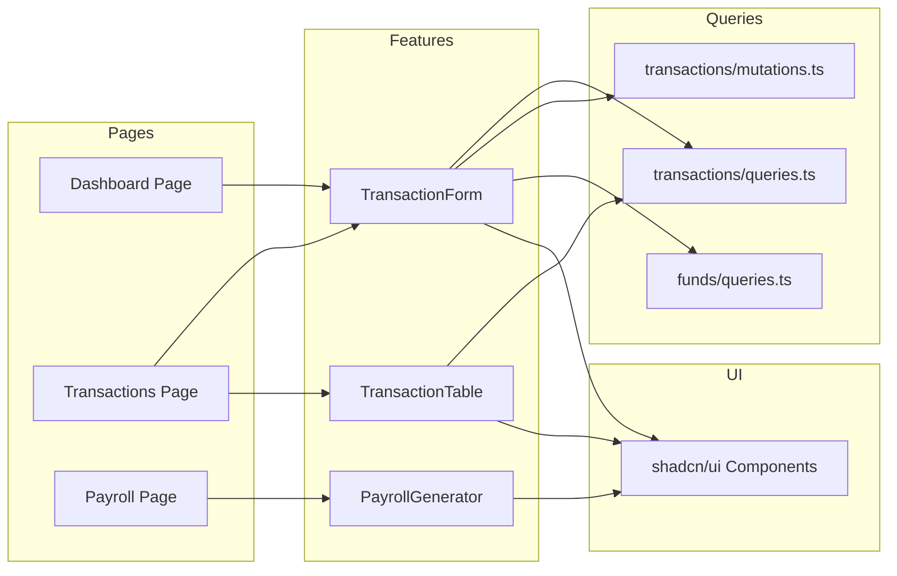

# Components

## API Layer (Next.js API Routes)
**Responsibility:** Handle HTTP requests, validate input, delegate to services
**Key Interfaces:** REST endpoints under `/api/v1/*`
**Dependencies:** Auth middleware, Validation middleware, Services
**Technology Stack:** Next.js API Routes, Yup validation

## Backend Validation Middleware
**Responsibility:** Centralized request validation at API boundary using Yup schemas
**Key Interfaces:**
```typescript
// src/lib/api/validate.ts
import { ObjectSchema } from 'yup';
import { NextRequest } from 'next/server';
import { ApiError } from './api-error';

export async function validateRequest<T>(
  req: NextRequest,
  schema: ObjectSchema<T>
): Promise<T> {
  try {
    const body = await req.json();
    return await schema.validate(body, { abortEarly: false, stripUnknown: true });
  } catch (error) {
    if (error instanceof Yup.ValidationError) {
      throw new ApiError('VALIDATION_ERROR', 'Dữ liệu không hợp lệ', 400, {
        fields: error.inner.map((e) => ({
          path: e.path,
          message: e.message,
        })),
      });
    }
    throw error;
  }
}

// Usage in API route
export async function POST(req: NextRequest) {
  const data = await validateRequest(req, createTransactionSchema);
  // data is now typed and validated
  return TransactionService.create(data);
}
```
**Location:** `src/lib/api/validate.ts`
**Shared Schemas:** `src/lib/validations/*.schema.ts` (used by both FE and BE)
**Technology Stack:** Yup, TypeScript

## Auth Middleware
**Responsibility:** Verify JWT tokens, attach user to request
**Key Interfaces:** `withAuth()` HOC for API routes
**Dependencies:** NextAuth.js, JWT
**Technology Stack:** NextAuth.js v5

## RBAC Middleware
**Responsibility:** Check user permissions for route access
**Key Interfaces:** `withPermission(permissions[])` HOC
**Dependencies:** Auth Middleware, Role permissions map
**Technology Stack:** Custom middleware

## Service Layer
**Responsibility:** Business logic, validation rules, cross-entity operations
**Key Interfaces:** `TransactionService`, `PayrollService`, `AuditService`
**Dependencies:** Mongoose models
**Technology Stack:** TypeScript classes/modules

## Mongoose Models
**Responsibility:** Data access, schema validation, virtuals, middleware
**Key Interfaces:** Model classes with static/instance methods
**Dependencies:** MongoDB connection
**Technology Stack:** Mongoose 8.x

## React Query Hooks (Domain-Based)
**Responsibility:** Data fetching, caching, mutations organized by domain
**Key Interfaces:**
- `queries/keys.ts` - **CENTRALIZED** query keys for ALL domains (single file)
- `queries/{domain}/queries.ts` - useQuery hooks with generics (list, detail, search)
- `queries/{domain}/mutations.ts` - useMutation hooks with callbacks (create, update, delete, approve)
**Dependencies:** TanStack Query, API client
**Technology Stack:** TanStack Query v5
**Key Patterns:**
- All query keys in single `keys.ts` file for easy management
- Queries/Mutations use TypeScript generics for type inference
- Mutations accept callbacks for success/error handling (no inline toast)

## UI Components (shadcn/ui)
**Responsibility:** Reusable UI primitives
**Key Interfaces:** Button, Dialog, Form, Table, etc.
**Dependencies:** Tailwind CSS, Radix UI
**Technology Stack:** shadcn/ui, Tailwind CSS

## GenericForm Wrapper
**Responsibility:** Centralized form handling with consistent validation, loading states, and error handling
**Key Interfaces:**
```typescript
interface GenericFormProps<TData extends FieldValues, TResponse = unknown> {
  schema: Yup.ObjectSchema<TData>;
  defaultValues: TData;
  onSubmit: (data: TData) => Promise<TResponse>;
  onSuccess?: (response: TResponse) => void;
  onError?: (error: ApiError) => void;
  children: (form: UseFormReturn<TData>) => React.ReactNode;
  submitLabel?: string;
  resetOnSuccess?: boolean;
}
```
**Dependencies:** React Hook Form, Yup, UI Components
**Technology Stack:** React 19, TypeScript
**Location:** `src/components/shared/generic-form.tsx`
**Usage Pattern:**
```typescript
<GenericForm
  schema={transactionSchema}
  defaultValues={defaultTransaction}
  onSubmit={(data) => createTransactionMutation.mutateAsync(data)}
  onSuccess={(response) => toast.success('Tạo giao dịch thành công')}
  onError={(error) => toast.error(error.message)}
>
  {(form) => (
    <>
      <FormField control={form.control} name="amount" ... />
      <FormField control={form.control} name="description" ... />
    </>
  )}
</GenericForm>
```

## GenericTable Wrapper
**Responsibility:** Centralized table handling with consistent pagination, sorting, filtering, and loading states
**Key Interfaces:**
```typescript
interface GenericTableProps<TData, TFilters = Record<string, unknown>> {
  columns: ColumnDef<TData>[];
  data: TData[];
  isLoading?: boolean;
  pagination?: {
    pageIndex: number;
    pageSize: number;
    total: number;
    onPageChange: (page: number) => void;
    onPageSizeChange: (size: number) => void;
  };
  filters?: {
    values: TFilters;
    onChange: (filters: TFilters) => void;
    schema?: React.ReactNode;
  };
  sorting?: {
    field: string;
    direction: 'asc' | 'desc';
    onSortChange: (field: string, direction: 'asc' | 'desc') => void;
  };
  emptyMessage?: string;
  onRowClick?: (row: TData) => void;
  rowActions?: (row: TData) => React.ReactNode;
}
```
**Dependencies:** TanStack Table, UI Components
**Technology Stack:** React 19, TypeScript
**Location:** `src/components/shared/generic-table.tsx`
**Usage Pattern:**
```typescript
<GenericTable
  columns={transactionColumns}
  data={transactions}
  isLoading={isLoading}
  pagination={{
    pageIndex: page,
    pageSize: 20,
    total: total,
    onPageChange: setPage,
    onPageSizeChange: setPageSize,
  }}
  filters={{
    values: filters,
    onChange: setFilters,
    schema: <TransactionFilterSchema />,
  }}
  rowActions={(row) => <TransactionActions transaction={row} />}
/>
```

## Feature Components
**Responsibility:** Business-specific UI using GenericForm/GenericTable wrappers
**Key Interfaces:** Props-driven React components
**Dependencies:** GenericForm, GenericTable, React Query hooks
**Technology Stack:** React 19, TypeScript

## Component Diagrams


## React Query Implementation Patterns

### Centralized Query Keys (queries/keys.ts)
**Location:** `src/queries/keys.ts` - Single file for ALL query keys
**Rationale:**
- Single source of truth for cache invalidation
- Easy to find and update keys
- Prevents key duplication across domains
- Better IDE autocomplete support

```typescript
// src/queries/keys.ts
// ============================================================================
// CENTRALIZED QUERY KEYS - All domains in one file
// ============================================================================

export const queryKeys = {
  // ---------------------------------------------------------------------------
  // Transactions
  // ---------------------------------------------------------------------------
  transactions: {
    all: ['transactions'] as const,
    lists: () => [...queryKeys.transactions.all, 'list'] as const,
    list: (filters: TransactionFilters) => [...queryKeys.transactions.lists(), filters] as const,
    details: () => [...queryKeys.transactions.all, 'detail'] as const,
    detail: (id: string) => [...queryKeys.transactions.details(), id] as const,
    pending: () => [...queryKeys.transactions.all, 'pending'] as const,
  },

  // ---------------------------------------------------------------------------
  // Funds
  // ---------------------------------------------------------------------------
  funds: {
    all: ['funds'] as const,
    lists: () => [...queryKeys.funds.all, 'list'] as const,
    list: (filters?: FundFilters) => [...queryKeys.funds.lists(), filters] as const,
    details: () => [...queryKeys.funds.all, 'detail'] as const,
    detail: (id: string) => [...queryKeys.funds.details(), id] as const,
  },

  // ---------------------------------------------------------------------------
  // Categories
  // ---------------------------------------------------------------------------
  categories: {
    all: ['categories'] as const,
    lists: () => [...queryKeys.categories.all, 'list'] as const,
    list: (type?: 'INCOME' | 'EXPENSE') => [...queryKeys.categories.lists(), type] as const,
    tree: () => [...queryKeys.categories.all, 'tree'] as const,
  },

  // ---------------------------------------------------------------------------
  // Bank Accounts
  // ---------------------------------------------------------------------------
  bankAccounts: {
    all: ['bankAccounts'] as const,
    lists: () => [...queryKeys.bankAccounts.all, 'list'] as const,
    list: (filters?: BankAccountFilters) => [...queryKeys.bankAccounts.lists(), filters] as const,
    detail: (id: string) => [...queryKeys.bankAccounts.all, 'detail', id] as const,
  },

  // ---------------------------------------------------------------------------
  // Entities
  // ---------------------------------------------------------------------------
  entities: {
    all: ['entities'] as const,
    lists: () => [...queryKeys.entities.all, 'list'] as const,
    list: (filters?: EntityFilters) => [...queryKeys.entities.lists(), filters] as const,
    search: (term: string) => [...queryKeys.entities.all, 'search', term] as const,
  },

  // ---------------------------------------------------------------------------
  // Parishes
  // ---------------------------------------------------------------------------
  parishes: {
    all: ['parishes'] as const,
    lists: () => [...queryKeys.parishes.all, 'list'] as const,
    list: (filters?: ParishFilters) => [...queryKeys.parishes.lists(), filters] as const,
    detail: (id: string) => [...queryKeys.parishes.all, 'detail', id] as const,
  },

  // ---------------------------------------------------------------------------
  // Parishioners
  // ---------------------------------------------------------------------------
  parishioners: {
    all: ['parishioners'] as const,
    lists: () => [...queryKeys.parishioners.all, 'list'] as const,
    list: (filters: ParishionerFilters) => [...queryKeys.parishioners.lists(), filters] as const,
    detail: (id: string) => [...queryKeys.parishioners.all, 'detail', id] as const,
  },

  // ---------------------------------------------------------------------------
  // Employees
  // ---------------------------------------------------------------------------
  employees: {
    all: ['employees'] as const,
    lists: () => [...queryKeys.employees.all, 'list'] as const,
    list: (filters?: EmployeeFilters) => [...queryKeys.employees.lists(), filters] as const,
    detail: (id: string) => [...queryKeys.employees.all, 'detail', id] as const,
    contracts: (employeeId: string) => [...queryKeys.employees.all, employeeId, 'contracts'] as const,
  },

  // ---------------------------------------------------------------------------
  // Payrolls
  // ---------------------------------------------------------------------------
  payrolls: {
    all: ['payrolls'] as const,
    lists: () => [...queryKeys.payrolls.all, 'list'] as const,
    list: (filters?: PayrollFilters) => [...queryKeys.payrolls.lists(), filters] as const,
    detail: (id: string) => [...queryKeys.payrolls.all, 'detail', id] as const,
  },

  // ---------------------------------------------------------------------------
  // Assets
  // ---------------------------------------------------------------------------
  assets: {
    all: ['assets'] as const,
    lists: () => [...queryKeys.assets.all, 'list'] as const,
    list: (filters?: AssetFilters) => [...queryKeys.assets.lists(), filters] as const,
    detail: (id: string) => [...queryKeys.assets.all, 'detail', id] as const,
  },

  // ---------------------------------------------------------------------------
  // Rental Contracts
  // ---------------------------------------------------------------------------
  rentalContracts: {
    all: ['rentalContracts'] as const,
    lists: () => [...queryKeys.rentalContracts.all, 'list'] as const,
    list: (filters?: RentalContractFilters) => [...queryKeys.rentalContracts.lists(), filters] as const,
    detail: (id: string) => [...queryKeys.rentalContracts.all, 'detail', id] as const,
    payments: (contractId: string) => [...queryKeys.rentalContracts.all, contractId, 'payments'] as const,
  },

  // ---------------------------------------------------------------------------
  // Users
  // ---------------------------------------------------------------------------
  users: {
    all: ['users'] as const,
    lists: () => [...queryKeys.users.all, 'list'] as const,
    list: (filters?: UserFilters) => [...queryKeys.users.lists(), filters] as const,
    detail: (id: string) => [...queryKeys.users.all, 'detail', id] as const,
    me: () => [...queryKeys.users.all, 'me'] as const,
  },

  // ---------------------------------------------------------------------------
  // Audit Logs
  // ---------------------------------------------------------------------------
  auditLogs: {
    all: ['auditLogs'] as const,
    lists: () => [...queryKeys.auditLogs.all, 'list'] as const,
    list: (filters: AuditLogFilters) => [...queryKeys.auditLogs.lists(), filters] as const,
  },

  // ---------------------------------------------------------------------------
  // Dashboard
  // ---------------------------------------------------------------------------
  dashboard: {
    all: ['dashboard'] as const,
    stats: () => [...queryKeys.dashboard.all, 'stats'] as const,
    pending: () => [...queryKeys.dashboard.all, 'pending'] as const,
  },
} as const;

// Type helper for query key inference
export type QueryKeys = typeof queryKeys;
```

### Generic Query Hook Pattern (queries/transactions/queries.ts)
```typescript
import { useQuery, UseQueryOptions } from '@tanstack/react-query';
import { queryKeys } from '../keys';
import { apiClient } from '@/lib/api/client';
import { ITransaction, ApiResponse, PaginatedResponse } from '@/types';

// Generic list query with type inference
export function useTransactions<TData = PaginatedResponse<ITransaction>>(
  filters: TransactionFilters,
  options?: Omit<UseQueryOptions<TData>, 'queryKey' | 'queryFn'>
) {
  return useQuery<TData>({
    queryKey: queryKeys.transactions.list(filters),
    queryFn: () => apiClient.get<TData>('/transactions', { params: filters }),
    ...options,
  });
}

// Generic detail query with type inference
export function useTransaction<TData = ApiResponse<ITransaction>>(
  id: string,
  options?: Omit<UseQueryOptions<TData>, 'queryKey' | 'queryFn'>
) {
  return useQuery<TData>({
    queryKey: queryKeys.transactions.detail(id),
    queryFn: () => apiClient.get<TData>(`/transactions/${id}`),
    enabled: !!id,
    ...options,
  });
}
```

### Generic Mutation Hook Pattern with Callbacks (queries/transactions/mutations.ts)
**Key Pattern:** Mutations receive callbacks via options - NO toast/message inside hooks
```typescript
import { useMutation, useQueryClient, UseMutationOptions } from '@tanstack/react-query';
import { queryKeys } from '../keys';
import { apiClient } from '@/lib/api/client';
import { ITransaction, CreateTransactionInput, ApiResponse, ApiError } from '@/types';

// Callback types for mutation hooks
interface MutationCallbacks<TData, TVariables> {
  onSuccess?: (data: TData, variables: TVariables) => void;
  onError?: (error: ApiError, variables: TVariables) => void;
}

// Generic create mutation - caller handles success/error messages
export function useCreateTransaction<TData = ApiResponse<ITransaction>>(
  callbacks?: MutationCallbacks<TData, CreateTransactionInput>
) {
  const queryClient = useQueryClient();

  return useMutation<TData, ApiError, CreateTransactionInput>({
    mutationFn: (data) => apiClient.post<TData>('/transactions', data),
    onSuccess: (data, variables) => {
      // Only handle cache invalidation here
      queryClient.invalidateQueries({ queryKey: queryKeys.transactions.lists() });
      // Delegate message/toast to caller
      callbacks?.onSuccess?.(data, variables);
    },
    onError: (error, variables) => {
      // Delegate error handling to caller
      callbacks?.onError?.(error, variables);
    },
  });
}

// Generic approve mutation
export function useApproveTransaction<TData = ApiResponse<ITransaction>>(
  callbacks?: MutationCallbacks<TData, string>
) {
  const queryClient = useQueryClient();

  return useMutation<TData, ApiError, string>({
    mutationFn: (id) => apiClient.patch<TData>(`/transactions/${id}/approve`),
    onSuccess: (data, id) => {
      // Handle cache invalidation
      queryClient.invalidateQueries({ queryKey: queryKeys.transactions.detail(id) });
      queryClient.invalidateQueries({ queryKey: queryKeys.transactions.lists() });
      queryClient.invalidateQueries({ queryKey: queryKeys.funds.all });
      // Delegate message to caller
      callbacks?.onSuccess?.(data, id);
    },
    onError: (error, id) => {
      callbacks?.onError?.(error, id);
    },
  });
}

// Usage in component - caller controls messages
const createMutation = useCreateTransaction({
  onSuccess: (response) => toast.success('Tạo giao dịch thành công'),
  onError: (error) => toast.error(error.message || 'Có lỗi xảy ra'),
});

const approveMutation = useApproveTransaction({
  onSuccess: () => toast.success('Đã duyệt giao dịch'),
  onError: (error) => toast.error(`Duyệt thất bại: ${error.message}`),
});
```
