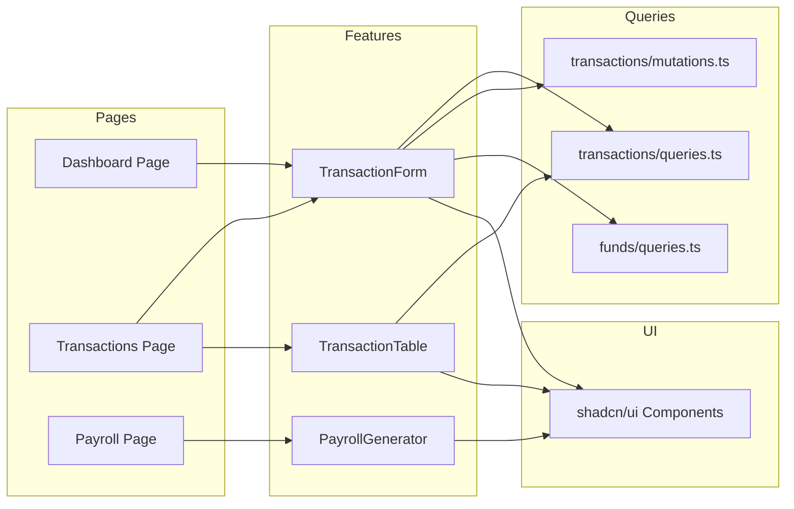

# Components

## API Layer (Next.js API Routes)
**Responsibility:** Handle HTTP requests, validate input, delegate to services
**Key Interfaces:** REST endpoints under `/api/v1/*`
**Dependencies:** Auth middleware, Services
**Technology Stack:** Next.js API Routes, Yup validation

## Auth Middleware
**Responsibility:** Verify JWT tokens, attach user to request
**Key Interfaces:** `withAuth()` HOC for API routes
**Dependencies:** NextAuth.js, JWT
**Technology Stack:** NextAuth.js v5

## RBAC Middleware
**Responsibility:** Check user permissions for route access
**Key Interfaces:** `withPermission(permissions[])` HOC
**Dependencies:** Auth Middleware, Role permissions map
**Technology Stack:** Custom middleware

## Service Layer
**Responsibility:** Business logic, validation rules, cross-entity operations
**Key Interfaces:** `TransactionService`, `PayrollService`, `AuditService`
**Dependencies:** Mongoose models
**Technology Stack:** TypeScript classes/modules

## Mongoose Models
**Responsibility:** Data access, schema validation, virtuals, middleware
**Key Interfaces:** Model classes with static/instance methods
**Dependencies:** MongoDB connection
**Technology Stack:** Mongoose 8.x

## React Query Hooks (Domain-Based)
**Responsibility:** Data fetching, caching, mutations organized by domain
**Key Interfaces:**
- `keys.ts` - Query key factories for cache management
- `queries.ts` - useQuery hooks (list, detail, search)
- `mutations.ts` - useMutation hooks (create, update, delete, approve)
**Dependencies:** TanStack Query, API client
**Technology Stack:** TanStack Query v5

## UI Components (shadcn/ui)
**Responsibility:** Reusable UI primitives
**Key Interfaces:** Button, Dialog, Form, Table, etc.
**Dependencies:** Tailwind CSS, Radix UI
**Technology Stack:** shadcn/ui, Tailwind CSS

## Feature Components
**Responsibility:** Business-specific UI (TransactionForm, PayrollTable)
**Key Interfaces:** Props-driven React components
**Dependencies:** UI Components, React Query hooks, React Hook Form
**Technology Stack:** React 19, TypeScript

## Component Diagrams

