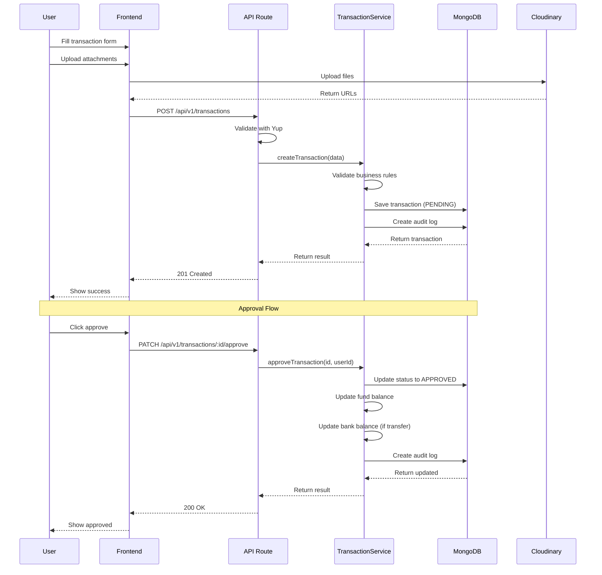
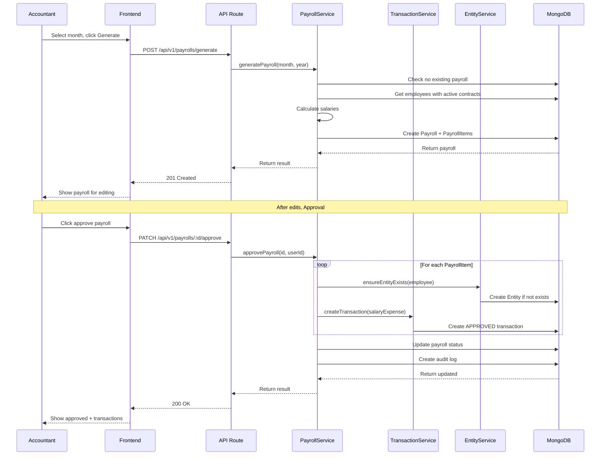

# Core Workflows

## Transaction Creation and Approval

```mermaid
sequenceDiagram
    participant U as User
    participant F as Frontend
    participant A as API Route
    participant S as TransactionService
    participant DB as MongoDB
    participant CL as Cloudinary

    U->>F: Fill transaction form
    U->>F: Upload attachments
    F->>CL: Upload files
    CL-->>F: Return URLs
    F->>A: POST /api/v1/transactions
    A->>A: Validate with Yup
    A->>S: createTransaction(data)
    S->>S: Validate business rules
    S->>DB: Save transaction (PENDING)
    S->>DB: Create audit log
    DB-->>S: Return transaction
    S-->>A: Return result
    A-->>F: 201 Created
    F-->>U: Show success

    Note over U,DB: Approval Flow
    U->>F: Click approve
    F->>A: PATCH /api/v1/transactions/:id/approve
    A->>S: approveTransaction(id, userId)
    S->>DB: Update status to APPROVED
    S->>S: Update fund balance
    S->>S: Update bank balance (if transfer)
    S->>DB: Create audit log
    DB-->>S: Return updated
    S-->>A: Return result
    A-->>F: 200 OK
    F-->>U: Show approved
```

## Payroll Generation and Transaction Creation

```mermaid
sequenceDiagram
    participant U as Accountant
    participant F as Frontend
    participant A as API Route
    participant PS as PayrollService
    participant TS as TransactionService
    participant ES as EntityService
    participant DB as MongoDB

    U->>F: Select month, click Generate
    F->>A: POST /api/v1/payrolls/generate
    A->>PS: generatePayroll(month, year)
    PS->>DB: Check no existing payroll
    PS->>DB: Get employees with active contracts
    PS->>PS: Calculate salaries
    PS->>DB: Create Payroll + PayrollItems
    DB-->>PS: Return payroll
    PS-->>A: Return result
    A-->>F: 201 Created
    F-->>U: Show payroll for editing

    Note over U,DB: After edits, Approval
    U->>F: Click approve payroll
    F->>A: PATCH /api/v1/payrolls/:id/approve
    A->>PS: approvePayroll(id, userId)

    loop For each PayrollItem
        PS->>ES: ensureEntityExists(employee)
        ES->>DB: Create Entity if not exists
        PS->>TS: createTransaction(salaryExpense)
        TS->>DB: Create APPROVED transaction
    end

    PS->>DB: Update payroll status
    PS->>DB: Create audit log
    DB-->>PS: Return updated
    PS-->>A: Return result
    A-->>F: 200 OK
    F-->>U: Show approved + transactions
```
