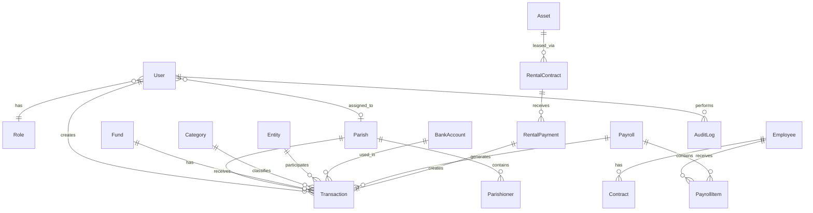

# Database Schema

## Collections Overview

### users
| Field | Type | Constraints | Description |
|-------|------|-------------|-------------|
| _id | ObjectId | PK | Primary key |
| email | String | unique, required | Login email |
| passwordHash | String | required | Bcrypt hash |
| name | String | required | Display name |
| phone | String | | Contact phone |
| role | ObjectId | ref: roles | User role |
| parish | ObjectId | ref: parishes | Assigned parish |
| isActive | Boolean | default: true | Account status |
| mustChangePassword | Boolean | default: false | Force password change |
| createdAt | Date | | Auto timestamp |
| updatedAt | Date | | Auto timestamp |

### transactions
| Field | Type | Constraints | Description |
|-------|------|-------------|-------------|
| _id | ObjectId | PK | Primary key |
| transactionNumber | String | unique | Auto-generated code |
| type | String | enum | INCOME/EXPENSE/ADJUSTMENT |
| fund | ObjectId | ref: funds, required | Associated fund |
| category | ObjectId | ref: categories, required | Classification |
| entity | ObjectId | ref: entities, required | Counterparty |
| amount | Number | required, min: 0 | Transaction amount |
| adjustmentType | String | enum | INCREASE/DECREASE |
| adjustmentReason | String | | Reason for adjustment |
| paymentMethod | String | enum, required | CASH/TRANSFER |
| bankAccount | ObjectId | ref: bank_accounts | For transfers |
| description | String | | Transaction notes |
| transactionDate | Date | required | When occurred |
| attachments | [String] | | Cloudinary URLs |
| status | String | enum, default: PENDING | Approval status |
| rejectionReason | String | | If rejected |
| approvedBy | ObjectId | ref: users | Approver |
| approvedAt | Date | | Approval timestamp |
| createdBy | ObjectId | ref: users, required | Creator |
| parish | ObjectId | ref: parishes | For parish transactions |
| sourceType | String | enum | MANUAL/PAYROLL/RENTAL |
| sourceId | ObjectId | | Reference to source |
| createdAt | Date | | Auto timestamp |
| updatedAt | Date | | Auto timestamp |

## Indexes
```javascript
// users
{ email: 1 } // unique
{ role: 1 }
{ parish: 1 }

// transactions
{ transactionNumber: 1 } // unique
{ type: 1, status: 1 }
{ fund: 1 }
{ category: 1 }
{ entity: 1 }
{ transactionDate: -1 }
{ status: 1, createdAt: -1 }
{ parish: 1 }
{ createdBy: 1 }
{ sourceType: 1, sourceId: 1 }

// payrolls
{ month: 1, year: 1 } // unique compound

// audit_logs
{ user: 1 }
{ entityType: 1, entityId: 1 }
{ createdAt: -1 }
{ action: 1 }
```

## Entity Relationship Diagram

