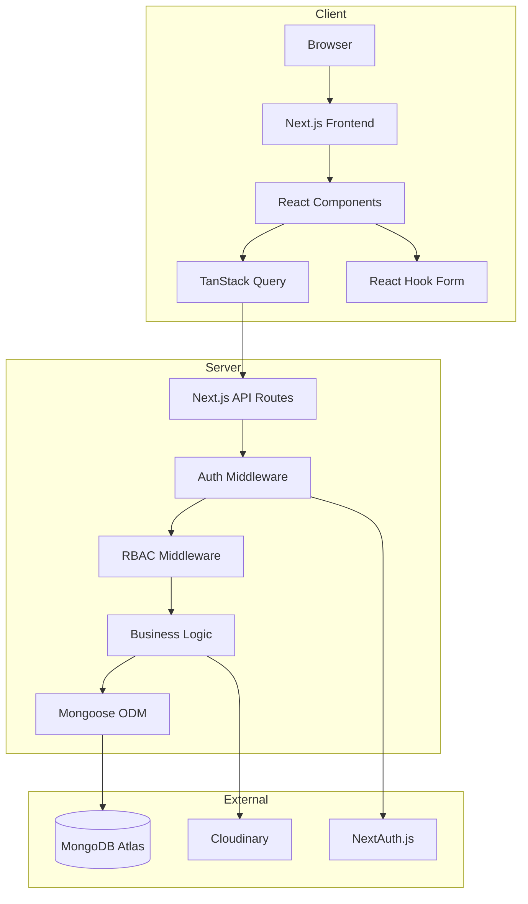

# High Level Architecture

## Technical Summary
GPBMT.ORG is a fullstack web application built with Next.js 15+ using the App Router pattern. The system follows a monolithic architecture with clear separation between presentation, business logic, and data layers. MongoDB serves as the primary database with Mongoose ODM for schema validation. Authentication is handled via NextAuth.js with JWT tokens. File uploads are managed through Cloudinary. The frontend uses shadcn/ui components with Tailwind CSS for styling, TanStack React Table for data grids, and TanStack React Query for server state management with domain-based hook organization.

## High Level Overview
- **Architecture Style:** Monolith with layered architecture
- **Repository Structure:** Monorepo (single Next.js project)
- **API Style:** REST API via Next.js API Routes
- **State Management:** TanStack React Query for server state (domain-based), React Context for UI state
- **Authentication:** NextAuth.js with JWT + RBAC middleware

## High Level Project Diagram

## Architectural and Design Patterns
- **Repository Pattern:** Mongoose models encapsulate data access logic - _Rationale:_ Clean separation, easier testing
- **Service Layer:** Business logic in dedicated service modules - _Rationale:_ Reusable logic, single responsibility
- **Middleware Chain:** Auth → RBAC → Validation → Handler - _Rationale:_ Consistent security enforcement
- **DTO Pattern:** Yup schemas for validation at both FE and BE boundaries - _Rationale:_ Type-safe data transfer, shared schemas
- **Observer Pattern:** Mongoose middleware for audit logging - _Rationale:_ Automatic, non-intrusive logging
- **Centralized Query Keys:** Single `keys.ts` file for ALL domains - _Rationale:_ Single source of truth, easy cache invalidation
- **Generic Form/Table Wrappers:** Consistent handling of forms and tables - _Rationale:_ DRY, unified UX, centralized validation
- **Mutation Callbacks:** Mutations receive callbacks, no inline side effects - _Rationale:_ Separation of concerns, testable hooks
